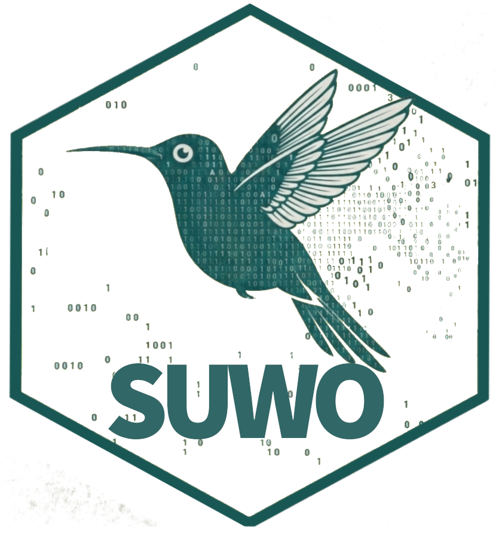

suwo: access nature media repositories
================

<!-- README.md is generated from README.Rmd. Please edit that file -->
<!-- badges: start -->

[](https://lifecycle.r-lib.org/articles/stages.html)
<!-- [](https://cran.r-project.org/package=suwo)  -->
[](https://www.repostatus.org/#active)
[](https://www.gnu.org/licenses/gpl-3.0.en.html)
<!-- [](https://cran.r-project.org/)  -->
<!-- [](commits/develop)  -->
[](/commits/main)
[](https://app.codecov.io/gh/maRce10/suwo?branch=main)
[](https://github.com/maRce10/suwo/actions?query=workflow%3Apkgcheck)  
<!-- [](https://cran.r-project.org/package=suwo) -->
<!-- [](https://cranlogs.r-pkg.org/badges/grand-total/suwo) -->
[](https://github.com/maRce10/suwo/actions/workflows/R-CMD-check.yaml)
<!-- badges: end -->

<!--  -->
<!--  -->
<!-- <a href="https://marce10.github.io/suwo/"></a> -->

The [suwo](https://marce10.github.io/suwo/) package aims to simplify the
retrieval of nature media (mostly photos, audio files and videos) across
multiple online biodiversity databases. The five major media
repositories accessed by this package (GBIF, iNaturalist, Macaulay
Library, WikiAves, and Xeno-Canto) collectively host more than 250
million media files. Such media are increasingly used in diverse fields,
ranging from ecology and evolutionary biology (e.g., trait evolution) to
wildlife monitoring and conservation (e.g., for training species
detection models). The ability to access and download large amounts of
media files and their associated metadata from a single interface thus
provides a uniquely powerful resource for facilitating research and
conservation efforts.

The main features of the package are:

- Obtaining media metadata from online repositories
- Downloading associated media files
- Updating data sets with new records

## Installing suwo

Install the package from CRAN:

``` r
# install from CRAN
install.packages("suwo")

# load package
library(suwo)
```

Alternatively, the package can also be installed from R universe as
follows:

``` r
# From R universe would be
install.packages('suwo', repos = c('https://marce10.r-universe.dev'))

# load package
library(suwo)
```

To install the latest developmental version from
[github](https://github.com/) you will need the R package
[remotes](https://cran.r-project.org/package=remotes):

``` r
# install remotes if you don't have it yet
remotes::install_github("maRce10/suwo")

#load package
library(suwo)
```

# Basic workflow for obtaining nature media files

Obtaining nature media using [suwo](https://marce10.github.io/suwo/)
follows a basic sequence. The following diagram illustrates this
workflow and the main functions involved:

<center>

</center>

Take a look at the [package
vignette](https://marce10.github.io/suwo/articles/suwo.html) for an
overview of the workflow and the core querying functions.

## Intended use and responsible practices

The [suwo](https://marce10.github.io/suwo/) package is designed
exclusively for non-commercial, scientific purposes, including research,
education, and conservation. **Any commercial use of the data or media
retrieved through this package is strictly prohibited** unless explicit,
separate permission is granted directly from the original source
platforms and rights holders. Users are obligated to comply with the
specific terms of service and data use policies of each source database,
which often mandate attribution and similarly restrict commercial
application. The package developers assume no liability for misuse of
the retrieved data or violations of third-party terms of service.

## Citation

Please cite [suwo](https://marce10.github.io/suwo/) as follows:

Araya-Salas, M., J. Elizondo-Calvo & A. Rico-Guevara. 2025. suwo: access
nature media repositories. R package version 0.1.0.
