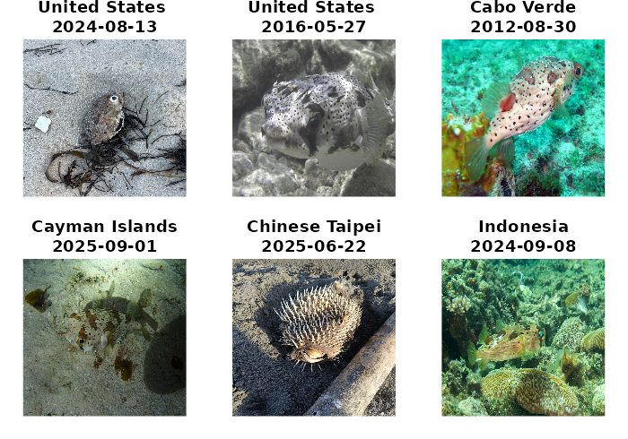

# package overview

 

The [suwo](https://marce10.github.io/suwo/) package aims to simplify the
retrieval of nature media (mostly photos, audio files and videos) across
multiple online biodiversity databases. This vignette provides an
overview of the package’s core querying functions, the searching and
downloading of media files, and the compilation of metadata from various
sources. For detailed information on each function, please refer to the
[function
reference](https://maRce10.github.io/suwo/reference/index.html) or use
the help files within R (e.g.,
[`?query_gbif`](https://marce10.github.io/suwo/reference/query_gbif.md)).

**Intended use and responsible practices**

This package is designed exclusively for non-commercial, scientific
purposes, including research, education, and conservation. Any
**commercial use of the data or media retrieved through this package is
strictly prohibited** unless explicit, separate permission is granted
directly from the original source platforms and content creators. Users
are obligated to comply with the specific terms of service and data use
policies of each source database, which often mandate attribution and
similarly restrict commercial application. The package developers assume
no liability for misuse of the retrieved data or violations of
third-party terms of service.

## Installation

Install the latest development version from GitHub:

``` r
# install package
remotes::install_github("maRce10/suwo")

#load packages
library(suwo)
```

## Basic workflow for obtaining nature media files

Obtaining nature media using [suwo](https://marce10.github.io/suwo/)
follows a basic sequence. The following diagram illustrates this
workflow and the main functions involved:


Here is a description of each step:

1.  Queries regarding a species are submitted through one of the
    available query functions (`query_repo_name()`) that connect to five
    different online repositories (Xeno-Canto, Inaturalist, GBIF,
    Macaulay Library and Wikiaves). The output of these queries is a
    data frame containing metadata associated with the media files
    (e.g., species name, date, location, etc, see below).

2.  If multiple repositories are queried, the resulting metadata data
    frames can be merged into a single data frame using the
    [merge_metadata()](https://marce10.github.io/suwo/reference/merge_metadata.html)
    function.

3.  Check for duplicate records in their datasets using the
    [find_duplicates()](https://marce10.github.io/suwo/reference/find_duplicates.html)
    function. Candidate duplicated entries are identified based on
    matching species name, country, date, user name, and geographic
    coordinates. User can double check the candidate duplicates and
    decide which records to keep, which can be done with
    [remove_duplicates()](https://marce10.github.io/suwo/reference/remove_duplicates.html).

4.  Download the media files associated with the metadata using the
    [download_media()](https://marce10.github.io/suwo/reference/download_media.html)
    function.

5.  Users can update their datasets with new records using the
    [update_metadata()](https://marce10.github.io/suwo/reference/update_metadata.html)
    function.

## Obtaining metadata: the query functions

The following table summarizes the available
[suwo](https://marce10.github.io/suwo/) query functions and the types of
metadata they retrieve:

``` r
# Load suwo package
library(suwo)
```

| Function                                                                             | Repository       | URL link                                                             | File types                                | Requires api key | Taxonomic level                           | Geographic coverage | Other features                                        |
|:-------------------------------------------------------------------------------------|:-----------------|:---------------------------------------------------------------------|:------------------------------------------|:-----------------|:------------------------------------------|:--------------------|:------------------------------------------------------|
| [query_gbif](https://marce10.github.io/suwo/reference/query_gbif.html)               | GBIF             | [https://www.gbif.org/](https://www.gbif.org/)                       | sound, image, video, interactive resource | No               | Species                                   | Global              | Specify query by data base                            |
| [query_inaturalist](https://marce10.github.io/suwo/reference/query_inaturalist.html) | iNaturalist      | [https://www.inaturalist.org/](https://www.inaturalist.org/)         | sound, image                              | No               | Species                                   | Global              | NA                                                    |
| [query_macaulay](https://marce10.github.io/suwo/reference/query_macaulay.html)       | Macaulay Library | [https://www.macaulaylibrary.org/](https://www.macaulaylibrary.org/) | sound, image, video                       | No               | Species                                   | Global              | Interactive                                           |
| [query_wikiaves](https://marce10.github.io/suwo/reference/query_wikiaves.html)       | Wikiaves         | [https://www.wikiaves.com.br/](https://www.wikiaves.com.br/)         | sound, image                              | No               | Species                                   | Brazil              | NA                                                    |
| [query_xenocanto](https://marce10.github.io/suwo/reference/query_xenocanto.html)     | Xeno-Canto       | [https://www.xeno-canto.org/](https://www.xeno-canto.org/)           | sound                                     | Yes              | Species, subspecies, genus, family, group | Global              | Specify query by taxonomy, geographic range and dates |

Table 1: Summary of query functions.

These are some example queries:

1.  Images of Sarapiqui Heliconia (*Heliconia sarapiquensis*) from
    iNaturalist (we print the first 4 rows of each output data frame):

``` r
# Load suwo package
library(suwo)

h_sarapiquensis <- query_inaturalist(species = "Heliconia sarapiquensis", 
                                     format = "image")

head(h_sarapiquensis, 4)
```

| repository  | format |    key    |         species         |    date    | time  |    user_name     | country |           locality           | latitude | longitude |                                    file_url                                     | file_extension |
|:-----------:|:------:|:---------:|:-----------------------:|:----------:|:-----:|:----------------:|:-------:|:----------------------------:|:--------:|:---------:|:-------------------------------------------------------------------------------:|:--------------:|
| iNaturalist | image  | 263417773 | Heliconia sarapiquensis | 2025-02-28 | 14:23 | Original Madness |   NA    | 10.163116739,-83.9389050007  | 10.16312 | -83.93891 | <https://inaturalist-open-data.s3.amazonaws.com/photos/473219810/original.jpeg> |      jpeg      |
| iNaturalist | image  | 263417128 | Heliconia sarapiquensis | 2025-02-28 | 14:18 | Original Madness |   NA    | 10.163116739,-83.9389050007  | 10.16312 | -83.93891 | <https://inaturalist-open-data.s3.amazonaws.com/photos/473218501/original.jpeg> |      jpeg      |
| iNaturalist | image  | 263415801 | Heliconia sarapiquensis | 2025-02-28 | 14:11 | Original Madness |   NA    | 10.163116739,-83.9389050007  | 10.16312 | -83.93891 | <https://inaturalist-open-data.s3.amazonaws.com/photos/473216124/original.jpeg> |      jpeg      |
| iNaturalist | image  | 234065037 | Heliconia sarapiquensis | 2024-08-05 | 16:57 | Shakiraprovasoli |   NA    | 10.4436533293,-84.0696545598 | 10.44365 | -84.06965 |         <https://static.inaturalist.org/photos/416318291/original.jpeg>         |      jpeg      |

2.  Harpy eagles (*Harpia harpyja*) audio recordings from Wikiaves:

``` r
h_harpyja <- query_wikiaves(species = "Harpia harpyja", format = "sound")

head(h_harpyja, 4)
```

| repository | format |   key   |    species     |    date    | time |     user_name     | country |     locality     | latitude | longitude |                                                   file_url                                                    | file_extension |
|:----------:|:------:|:-------:|:--------------:|:----------:|:----:|:-----------------:|:-------:|:----------------:|:--------:|:---------:|:-------------------------------------------------------------------------------------------------------------:|:--------------:|
|  Wikiaves  | sound  |  25867  | Harpia harpyja |     NA     |  NA  | Gustavo Pedersoli | Brazil  | Alta Floresta/MT |    NA    |    NA     |   <https://s3.amazonaws.com/media.wikiaves.com.br/recordings/52/25867_a73f0e8da2179e82af223ff27f74a912.mp3>   |      mp3       |
|  Wikiaves  | sound  | 2701424 | Harpia harpyja | 2020-10-20 |  NA  |    Bruno Lima     | Brazil  |   Itanhaém/SP    |    NA    |    NA     | <https://s3.amazonaws.com/media.wikiaves.com.br/recordings/1072/2701424_e0d533b952b64d6297c4aff21362474b.mp3> |      mp3       |
|  Wikiaves  | sound  | 878999  | Harpia harpyja | 2013-03-20 |  NA  |  Thiago Silveira  | Brazil  | Alta Floresta/MT |    NA    |    NA     |  <https://s3.amazonaws.com/media.wikiaves.com.br/recordings/878/878999_c1f8f4ba81fd597548752e92f1cdba50.mp3>  |      mp3       |
|  Wikiaves  | sound  | 3027120 | Harpia harpyja | 2016-06-20 |  NA  |    Ciro Albano    | Brazil  |    Camacan/BA    |    NA    |    NA     | <https://s3.amazonaws.com/media.wikiaves.com.br/recordings/7203/3027120_5148ce0fed5fe99aba7c65b2f045686a.mp3> |      mp3       |

3.  Common raccoon (*Procyon lotor*) videos from GBIF:

``` r
p_lotor <- query_gbif(species = "Procyon lotor", format = "video")

head(p_lotor, 4)
```

| repository | format |    key     |    species    |    date    | time | user_name |  country   | locality | latitude | longitude |                                            file_url                                             | file_extension |
|:----------:|:------:|:----------:|:-------------:|:----------:|:----:|:---------:|:----------:|:--------:|:--------:|:---------:|:-----------------------------------------------------------------------------------------------:|:--------------:|
|    GBIF    | video  | 3501153129 | Procyon lotor | 2015-07-21 |  NA  |    NA     | Luxembourg |    NA    | 49.7733  |  5.94092  | <https://archimg.mnhn.lu/Observations/Taxons/Biomonitoring/063_094_S2_K2_20150721_063004AM.mp4> |      m4a       |
|    GBIF    | video  | 3501153135 | Procyon lotor | 2015-07-04 |  NA  |    NA     | Luxembourg |    NA    | 49.7733  |  5.94092  | <https://archimg.mnhn.lu/Observations/Taxons/Biomonitoring/063_094_S2_K1_20150704_072418AM.mp4> |      m4a       |
|    GBIF    | video  | 3501153159 | Procyon lotor | 2015-07-04 |  NA  |    NA     | Luxembourg |    NA    | 49.7733  |  5.94092  | <https://archimg.mnhn.lu/Observations/Taxons/Biomonitoring/063_094_S2_K1_20150704_072402AM.mp4> |      m4a       |
|    GBIF    | video  | 3501153162 | Procyon lotor | 2015-07-04 |  NA  |    NA     | Luxembourg |    NA    | 49.7733  |  5.94092  | <https://archimg.mnhn.lu/Observations/Taxons/Biomonitoring/063_094_S2_K1_20150704_072346AM.mp4> |      m4a       |

------------------------------------------------------------------------

By default all query function return the 13 most basic metadata fields
associated with the media files. Here is the definition of each field:

- **repository**: Name of the repository
- **format**: Type of media file (e.g., sound, photo, video)
- **key**: Unique identifier of the media file in the repository
- **species**: Species name associated with the media file (Note
  taxonomic authority may vary among repositories)
- **date**\*: Date when the media file was recorded/photographed (in
  YYYY-MM-DD format or YYYY if only year is available)
- **time**\*: Time when the media file was recorded/photographed (in
  HH:MM format)
- **user_name**\*: Name of the user who uploaded the media file
- **country**\*: Country where the media file was recorded/photographed
- **locality**\*: Locality where the media file was
  recorded/photographed
- **latitude**\*: Latitude of the location where the media file was
  recorded/photographed (in decimal degrees)
- **longitude**\*: Longitude of the location where the media file was
  recorded/photographed (in decimal degrees)
- **file_url**: URL link to the media file (used to download media
  files)
- **file_extension**: Extension of the media file (e.g., .mp3, .jpg,
  .mp4)

*\* Can contain missing values (NAs)*

Users can also download all available metadata by setting the argument
`all_data = TRUE`. These are the additional metadata fields, on top of
the basic fields, that are retrieved by each query function:

| Function                                                                             | Additional data                                                                                                                                                                                                                                                                                                                                                                                                                                                                                                                                                                                                                                                                                                                                                                                                                                                                                                                                                                                                      |
|:-------------------------------------------------------------------------------------|:---------------------------------------------------------------------------------------------------------------------------------------------------------------------------------------------------------------------------------------------------------------------------------------------------------------------------------------------------------------------------------------------------------------------------------------------------------------------------------------------------------------------------------------------------------------------------------------------------------------------------------------------------------------------------------------------------------------------------------------------------------------------------------------------------------------------------------------------------------------------------------------------------------------------------------------------------------------------------------------------------------------------|
| [query_gbif](https://marce10.github.io/suwo/reference/query_gbif.html)               | datasetkey, publishingorgkey, installationkey, hostingorganizationkey, publishingcountry, protocol, lastcrawled, lastparsed, crawlid, basisofrecord, occurrencestatus, taxonkey, kingdom_code, phylum_code, class_code, order_code, family_key, genus_code, species_code, acceptedtaxonkey, scientificnameauthorship, acceptedscientificname, kingdom, phylum, order, family, genus, genericname, specific_epithet, taxonrank, taxonomicstatus, iucnredlistcategory, continent, year, month, day, startdayofyear, enddayofyear, lastinterpreted, license, organismquantity, organismquantitytype, issequenced, isincluster, datasetname, recordist, identifiedby, samplingprotocol, geodeticdatum, class, countrycode, gbifregion, publishedbygbifregion, recordnumber, identifier, habitat, verbatimeventdate, institutionid, dynamicproperties, verbatimcoordinatesystem, eventremarks, collectioncode, gbifid, occurrenceid, institutioncode, identificationqualifier, media_type, page, state_province, comments |
| [query_inaturalist](https://marce10.github.io/suwo/reference/query_inaturalist.html) | quality_grade, taxon_geoprivacy, uuid, cached_votes_total, identifications_most_agree, species_guess, identifications_most_disagree, positional_accuracy, comments_count, site_id, created_time_zone, license_code, observed_time_zone, public_positional_accuracy, oauth_application_id, created_at, description, time_zone_offset, observed_on, observed_on_string, updated_at, captive, faves_count, num_identification_agreements, identification_disagreements_count, map_scale, uri, community_taxon_id, owners_identification_from_vision, identifications_count, obscured, num_identification_disagreements, geoprivacy, spam, mappable, identifications_some_agree, place_guess, id, license_code_1, attribution, hidden, offset                                                                                                                                                                                                                                                                            |
| [query_macaulay](https://marce10.github.io/suwo/reference/query_macaulay.html)       | common_name, background_species, caption, year, month, day, country_state_county, state_province, county, age_sex, behavior, playback, captive, collected, specimen_id, home_archive_catalog_number, recorder, microphone, accessory, partner_institution, ebird_checklist_id, unconfirmed, air_temp\_*c*, water_temp\_*c*, media_notes, observation_details, parent_species, species_code, taxon_category, taxonomic_sort, recordist_2, average_community_rating, number_of_ratings, asset_tags, original_image_height, original_image_width                                                                                                                                                                                                                                                                                                                                                                                                                                                                        |
| [query_wikiaves](https://marce10.github.io/suwo/reference/query_wikiaves.html)       | user_id, species_code, common_name, repository_id, verified, locality_id, number_of_comments, likes, visualizations, duration                                                                                                                                                                                                                                                                                                                                                                                                                                                                                                                                                                                                                                                                                                                                                                                                                                                                                        |
| [query_xenocanto](https://marce10.github.io/suwo/reference/query_xenocanto.html)     | genus, specific_epithet, subspecies, taxonomic_group, english_name, altitude, vocalization_type, sex, stage, method, url, uploaded_file, license, quality, length, upload_date, other_species, comments, animal_seen, playback_used, temp, regnr, auto, recorder, microphone, sampling_rate, sonogram_small, sonogram_med, sonogram_large, sonogram_full, oscillogram_small, oscillogram_med, oscillogram_large, sonogram                                                                                                                                                                                                                                                                                                                                                                                                                                                                                                                                                                                            |

Table 2: Additional metadata per query function.

**Obtaining raw data**

By default the package standardizes the information in the basic fields
(detailed above) in order to facilitate the compilation of metadata from
multiple repositories. However, in some cases this may result in loss of
information. For instance, some repositories allow users to provide
“morning” as a valid time value, which are converted into NAs by
[suwo](https://marce10.github.io/suwo/). In such cases, users can
retrieve the original data by setting the `raw_data = TRUE` in the query
functions and/or global options (`options(raw_data = TRUE)`). Note that
subsequent data manipulation functions (e.g.,
[merge_metadata()](https://marce10.github.io/suwo/reference/merge_metadata.html),
[find_duplicates()](https://marce10.github.io/suwo/reference/find_duplicates.html),
etc) will not work as the basic fields are not standardized.

The code above examplifies the most common use of query functions, which
applies also to the function
[query_gbif()](https://marce10.github.io/suwo/reference/query_gbif.html).
The following sections provide more details on the two query functions
that require special considerations:
[query_macaulay()](https://marce10.github.io/suwo/reference/query_macaulay.html)
and
[query_xenocanto()](https://marce10.github.io/suwo/reference/query_xenocanto.html).

### query_macaulay()

#### Interactive retrieval of metadata

[query_macaulay()](https://marce10.github.io/suwo/reference/query_macaulay.html)
is the only interactive function. This means that when users run a query
the function opens a browser window to the [Macaulay Library’s search
page](https://search.macaulaylibrary.org/catalog), where the users must
download a .csv file with the metadata. Here is a example of a query for
strip-throated hermit (*Phaethornis striigularis*) videos:

``` r
p_striigularis <- query_macaulay(species = "Phaethornis striigularis", 
                                 format = "video")
```

Users must click on the “Export” button to save the .csv file with the
metadata:


Here are some tips for using this function properly:

- Valid species names can be checked at `suwo:::ml_taxon_code$SCI_NAME`
- The exported csv file must be saved in the directory specified by the
  `path` argument of the function (default is the current working
  directory)
- If the file is saved overwriting a pre-existing file (i.e. same file
  name) the function will not detect it
- The function will not proceed until the file is saved
- Users must log in to the Macaulay Library/eBird account in order to
  access large batches of observations

After saving the file, the function will read the file and return a data
frame with the metadata. Here we print the first 4 rows of the output
data frame:

``` r
head(p_striigularis, 4)
```

|    repository    | format |    key    |         species          |    date    | time  |        user_name         |  country   |          locality           | latitude | longitude |                               file_url                               | file_extension |
|:----------------:|:------:|:---------:|:------------------------:|:----------:|:-----:|:------------------------:|:----------:|:---------------------------:|:--------:|:---------:|:--------------------------------------------------------------------:|:--------------:|
| Macaulay Library | video  | 630814231 | Phaethornis striigularis | 2025-01-17 | 09:23 | Carlos Roberto Chavarria | Costa Rica | Tirimbina Rainforest Center | 10.41562 | -84.12078 | <https://cdn.download.ams.birds.cornell.edu/api/v1/asset/630814231/> |      mp4       |
| Macaulay Library | video  | 628258211 | Phaethornis striigularis | 2024-12-13 | 14:26 |     Russell Campbell     | Costa Rica | Reserva El Copal (Tausito)  | 9.78404  | -83.75147 | <https://cdn.download.ams.birds.cornell.edu/api/v1/asset/628258211/> |      mp4       |
| Macaulay Library | video  | 628258206 | Phaethornis striigularis | 2024-12-13 | 14:26 |     Russell Campbell     | Costa Rica | Reserva El Copal (Tausito)  | 9.78404  | -83.75147 | <https://cdn.download.ams.birds.cornell.edu/api/v1/asset/628258206/> |      mp4       |
| Macaulay Library | video  | 614437320 | Phaethornis striigularis | 2022-10-15 | 14:40 |      Josep Del Hoyo      | Costa Rica |    Laguna Lagarto Lodge     | 10.68515 | -84.18112 | <https://cdn.download.ams.birds.cornell.edu/api/v1/asset/614437320/> |      mp4       |

#### Bypassing record limit

Even if logged in, a maximum of 10000 records per query can be returned.
This can be bypassed by using the ‘dates’ argument to split the search
into a sequence of shorter date ranges. The rationale is that by
splitting the search into date ranges, users can download multiple .csv
files, which are then combined by the function into a single metadata
data frame. Of course users must download the csv for each data range.
The following code looks for photos of costa’s hummingbird (*Calypte
costae*). As Macaulay Library hosts more than 30000 costa’s hummingbird
records, we need to split the query into multiple date ranges:

``` r
# test a query with more than 10000 results paging by date
cal_cos <- query_macaulay(
  species = "Calypte costae",
  format = "image",
  path = tempdir(),
  dates = c(1976, 2019, 2022, 2024, 2025, 2026)
)
```

Users can check at the Macaulay Library website how many records are
available for their species of interest (see image below) and then
decide how to split the search by date ranges accordingly so each
sub-query has less than 10000 records.


### query_xenocanto()

#### API key

[Xeno-Canto](https://www.xeno-canto.org/) requires users to obtain a
free API key to use [their API
v3](https://xeno-canto.org/admin.php/explore/api). Users can get their
API key by creating an account at [Xeno-Canto’s registering
page](https://xeno-canto.org/auth/register). Once users have their API
key, they can use it in the
[query_xenocanto()](https://marce10.github.io/suwo/reference/query_xenocanto.html)
function by providing it as the `api_key` argument. Here is an example
of a query for Spix’s disc-winged bat (*Thyroptera tricolor*) audio
recordings:

``` r
# replace "YOUR_XC_API_KEY" with your key
t_tricolor <- query_xenocanto(species = "Thyroptera tricolor", 
                              api_key = "YOUR_XC_API_KEY")

head(t_tricolor, 4)
```

| repository | format |  key   |       species       |    date    | time  |        user_name         |  country   |               locality               | latitude | longitude |                 file_url                 | file_extension |
|:----------:|:------:|:------:|:-------------------:|:----------:|:-----:|:------------------------:|:----------:|:------------------------------------:|:--------:|:---------:|:----------------------------------------:|:--------------:|
| Xeno-Canto | sound  | 879621 | Thyroptera tricolor | 2023-07-15 | 12:30 |      José Tinajero       | Costa Rica | Hacienda Baru, Dominical, Costa Rica |  9.2635  | -83.8768  | <https://xeno-canto.org/879621/download> |      wav       |
| Xeno-Canto | sound  | 820604 | Thyroptera tricolor | 2013-01-10 | 19:00 | Sébastien J. Puechmaille | Costa Rica |    Pavo, Provincia de Puntarenas     |  8.4815  | -83.5945  | <https://xeno-canto.org/820604/download> |      wav       |
| Xeno-Canto | sound  | 820603 | Thyroptera tricolor | 2013-01-10 | 19:00 | Sébastien J. Puechmaille | Costa Rica |    Pavo, Provincia de Puntarenas     |  8.4815  | -83.5945  | <https://xeno-canto.org/820603/download> |      wav       |
| Xeno-Canto | sound  | 821928 | Thyroptera tricolor | 2013-01-10 | 19:00 |     Daniel j buckley     | Costa Rica |    Pavo, Provincia de Puntarenas     |  8.4815  | -83.5945  | <https://xeno-canto.org/821928/download> |      wav       |

### Special queries

[query_xenocanto()](https://marce10.github.io/suwo/reference/query_xenocanto.html)
allows users to perform special queries by specifying additional query
tags. Users can also search by country, taxonomy (taxonomic group,
family, genus, subspecies), geography (country, location, geographic
coordinates) date, sound type (e.g. female song, calls) and recording
properties (quality, length, sampling rate) ([see list of available tags
here](https://xeno-canto.org/admin.php/explore/api#examples)). Here is
an example of a query for audio recordings of pale-striped poison frog
(*Ameerega hahneli*, ’sp:“Ameerega hahneli”) from French Guiana
(cnt:“French Guiana”) and with the highest recording quality (q:“A”):

``` r
# replace "YOUR_XC_API_KEY" with your key
a_hahneli <- query_xenocanto(
  species = 'sp:"Ameerega hahneli" cnt:"French Guiana" q:"A"', 
  api_key = "YOUR_XC_API_KEY")

head(a_hahneli, 4)
```

| repository | format |  key   |     species      |    date    | time  |    user_name    |    country    |                               locality                               | latitude | longitude |                 file_url                 | file_extension |
|:----------:|:------:|:------:|:----------------:|:----------:|:-----:|:---------------:|:-------------:|:--------------------------------------------------------------------:|:--------:|:---------:|:----------------------------------------:|:--------------:|
| Xeno-Canto | sound  | 928987 | Ameerega hahneli | 2024-05-14 | 16:00 | Augustin Bussac | French Guiana |                          Sentier Gros-Arbre                          |  3.6132  | -53.2169  | <https://xeno-canto.org/928987/download> |      mp3       |
| Xeno-Canto | sound  | 928972 | Ameerega hahneli | 2024-04-24 | 17:00 | Augustin Bussac | French Guiana |                           Camp Bonaventure                           |  4.3226  | -52.3387  | <https://xeno-canto.org/928972/download> |      mp3       |
| Xeno-Canto | sound  | 928971 | Ameerega hahneli | 2023-11-26 | 13:00 | Augustin Bussac | French Guiana | Guyane Natural Regional Park (near Roura), Arrondissement of Cayenne |  4.5423  | -52.4432  | <https://xeno-canto.org/928971/download> |      mp3       |

## Update metadata

The
[update_metadata()](https://marce10.github.io/suwo/reference/update_metadata.html)
function allows users to update a previous query to add new information
from the corresponding repository of the original search. This function
takes as input a data frame previously obtained from any query function
(i.e. `query_reponame()`) and returns a data frame similar to the input
with new data appended.

To show case the function, we first query metadata of Eisentraut’s
Bow-winged Grasshopper sounds from iNaturalist. Let’s assume that the
initial query was done a while ago and we want to update it to include
any new records that might have been added since then. The following
code removes all observations recorded after 2024-12-31 to simulate an
old query:

``` r
# initial query
c_eisentrauti <- query_inaturalist(species = "Chorthippus eisentrauti")

head(c_eisentrauti, 4)
```

| repository  | format |    key    |         species         |    date    | time  |       user_name       | country |          locality          | latitude | longitude |                            file_url                            | file_extension |
|:-----------:|:------:|:---------:|:-----------------------:|:----------:|:-----:|:---------------------:|:-------:|:--------------------------:|:--------:|:---------:|:--------------------------------------------------------------:|:--------------:|
| iNaturalist | sound  | 326470869 | Chorthippus eisentrauti | 2025-11-13 | 14:26 | Eliot Stein-Deffarges |   NA    |  44.0506903802,7.64412147  | 44.05069 | 7.644121  | <https://static.inaturalist.org/sounds/1693720.wav?1763129563> |      wav       |
| iNaturalist | sound  | 326470844 | Chorthippus eisentrauti | 2025-11-13 | 13:30 | Eliot Stein-Deffarges |   NA    | 44.0489666389,7.6286233333 | 44.04897 | 7.628623  | <https://static.inaturalist.org/sounds/1693713.wav?1763128937> |      wav       |
| iNaturalist | sound  | 326470823 | Chorthippus eisentrauti | 2025-11-13 | 12:37 | Eliot Stein-Deffarges |   NA    | 44.0468833056,7.6305133333 | 44.04688 | 7.630513  | <https://static.inaturalist.org/sounds/1693708.wav?1763127622> |      wav       |
| iNaturalist | sound  | 319153344 | Chorthippus eisentrauti | 2025-09-23 | 11:05 | Eliot Stein-Deffarges |   NA    |   44.0312216667,7.510275   | 44.03122 | 7.510275  | <https://static.inaturalist.org/sounds/1659586.wav?1759761352> |      wav       |

``` r
# exclude new observations (simulate old data)
old_c_eisentrauti <- 
  c_eisentrauti[c_eisentrauti$date <= "2024-12-31" | is.na(c_eisentrauti$date), 
                ]

# update "old" data
upd_c_eisentrauti <- update_metadata(metadata = old_c_eisentrauti)

# compare number of records
nrow(old_c_eisentrauti) == nrow(upd_c_eisentrauti)
```

    [1] FALSE

## Combine metadata from multiple repositories

The
[merge_metadata()](https://marce10.github.io/suwo/reference/merge_metadata.html)
function allows users to combine metadata data frames obtained from
multiple query functions into a single data frame. The function will
match the basic columns of all data frames. Data from additional columns
(for instance when using `all_data = TRUE` in the query) will only be
combined if the column names from different repositories match. The
function will return a data frame that includes a new column called
`source` indicating the name of the original metadata data frame:

``` r
truf_xc <- query_xenocanto(species = "Turdus rufiventris",
                             format = "sound",
                             api_key = "YOUR_XC_API_KEY")
truf_gbf <- query_gbif(species = "Turdus rufiventris", format = "sound")
truf_ml <- query_macaulay(species = "Turdus rufiventris",
                          format = "sound",
                          path = tempdir())

# merge metadata
merged_metadata <- merge_metadata(truf_xc, truf_gbf, truf_ml)

head(merged_metadata, 4)
```

| repository | format |   key   |      species       |    date    | time  |         user_name          | country |                    locality                     | latitude | longitude |                 file_url                  | file_extension | source |
|:----------:|:------:|:-------:|:------------------:|:----------:|:-----:|:--------------------------:|:-------:|:-----------------------------------------------:|:--------:|:---------:|:-----------------------------------------:|:--------------:|:------:|
| Xeno-Canto | sound  | 1032061 | Turdus rufiventris | 2025-07-19 | 18:01 |       Jacob Wijpkema       | Bolivia |  Lagunillas, Cordillera, Santa Cruz Department  | -19.6348 | -63.6711  | <https://xeno-canto.org/1032061/download> |      wav       | xc_adf |
| Xeno-Canto | sound  | 1006659 | Turdus rufiventris | 2025-06-13 | 16:01 | Jayrson Araujo De Oliveira | Brazil  |    RPPN Flor das Águas - Pirenópolis, Goiás     | -15.8195 | -48.9861  | <https://xeno-canto.org/1006659/download> |      mp3       | xc_adf |
| Xeno-Canto | sound  | 979639  | Turdus rufiventris | 2025-03-12 | 08:00 |   Ricardo José Mitidieri   | Brazil  |       Tijuca, Teresópolis, Rio de Janeiro       | -22.4212 | -42.9559  | <https://xeno-canto.org/979639/download>  |      mp3       | xc_adf |
| Xeno-Canto | sound  | 974643  | Turdus rufiventris | 2025-02-14 | 13:11 | Jayrson Araujo De Oliveira | Brazil  | Fazenda Nazareth Eco, Jose de Freitas-PI, Piauí | -4.7958  | -42.6150  | <https://xeno-canto.org/974643/download>  |      mp3       | xc_adf |

Note that in such a multi-repository query, all query functions use the
same search species (i.e. species name) and media format (e.g., sound,
image, video). To facilitate this, users can set the global options
`species` and `format` so they do not need to specify them in each query
function:

``` r
options(species = "Turdus rufiventris", format = "sound")
truf_xc <- query_xenocanto(api_key = "YOUR_XC_API_KEY")
truf_gbf <- query_gbif()
truf_ml <- query_macaulay(path = tempdir())

# merge metadata
merged_metadata <- merge_metadata(truf_xc, truf_gbf, truf_ml)
```

## Find and remove duplicated records

When compiling data from multiple repositories, duplicated media records
are a common issue, particularly for sound recordings. These duplicates
occur both through data sharing between repositories like Xeno-Canto and
GBIF, and when users upload the same file to multiple platforms. To help
users efficiently identify these duplicate records,
[suwo](https://marce10.github.io/suwo/) provides the
[find_duplicates()](https://marce10.github.io/suwo/reference/find_duplicates.html)
function.

The
[find_duplicates()](https://marce10.github.io/suwo/reference/find_duplicates.html)
function helps users identify potential duplicate records in their
metadata data frames. Duplicates are identified based on matching
species name, country, date, user name, and locality. The function uses
a fuzzy matching approach to account for minor variations in the data
(e.g., typos, different location formats, etc).The output is a data
frame with the candidate duplicate records, allowing users to review and
decide which records to keep.

In this example we look for possible duplicates in the merged metadata
data frame from the previous section:

``` r
# find duplicates
dups_merged_metadata <- find_duplicates(merged_metadata)

# look first 6 columns
head(dups_merged_metadata)
```

| repository | format |    key     |      species       |    date    | time  |         user_name          | country |                         locality                          | latitude | longitude |                                                  file_url                                                  | file_extension |  source  | duplicate_group |
|:----------:|:------:|:----------:|:------------------:|:----------:|:-----:|:--------------------------:|:-------:|:---------------------------------------------------------:|:--------:|:---------:|:----------------------------------------------------------------------------------------------------------:|:--------------:|:--------:|:---------------:|
| Xeno-Canto | sound  |   913487   | Turdus rufiventris | 2024-06-07 | 06:46 | Jayrson Araujo De Oliveira | Brazil  | Reserva do Setor Sítio de Recreio Caraíbas-Goiânia, Goiás | -16.5631 | -49.2850  |                                  <https://xeno-canto.org/913487/download>                                  |      mp3       |  xc_adf  |        1        |
|    GBIF    | sound  | 4907346188 | Turdus rufiventris | 2024-06-07 | 06:46 | Jayrson Araujo De Oliveira | Brazil  | Reserva do Setor Sítio de Recreio Caraíbas-Goiânia, Goiás | -16.5631 | -49.2850  | <https://xeno-canto.org/sounds/uploaded/LXKLWEDKEM/XC913487-07-06-2024-6e46-Sabia-laranjeira-CARAIBAS.mp3> |      mp3       | gb_adf_s |        1        |
| Xeno-Canto | sound  |   351258   | Turdus rufiventris | 2013-10-11 | 17:27 |        Jeremy Minns        | Brazil  |               Miranda, MS. Refúgio da Ilha                | -20.2209 | -56.5751  |                                  <https://xeno-canto.org/351258/download>                                  |      mp3       |  xc_adf  |        2        |
|    GBIF    | sound  | 2243749719 | Turdus rufiventris | 2013-10-11 | 17:27 |        Jeremy Minns        | Brazil  |               Miranda, MS. Refúgio da Ilha                | -20.2209 | -56.5751  |                 <https://xeno-canto.org/sounds/uploaded/DGVLLRYDXS/XC351258-TURRUF68.mp3>                  |      mp3       | gb_adf_s |        2        |
| Xeno-Canto | sound  |   351066   | Turdus rufiventris | 2013-10-10 | 17:02 |        Jeremy Minns        | Brazil  |               Miranda, MS. Refúgio da Ilha                | -20.2209 | -56.5751  |                                  <https://xeno-canto.org/351066/download>                                  |      mp3       |  xc_adf  |        3        |
|    GBIF    | sound  | 2243747991 | Turdus rufiventris | 2013-10-10 | 17:02 |        Jeremy Minns        | Brazil  |               Miranda, MS. Refúgio da Ilha                | -20.2209 | -56.5751  |                 <https://xeno-canto.org/sounds/uploaded/DGVLLRYDXS/XC351066-TURRUF67.mp3>                  |      mp3       | gb_adf_s |        3        |

Note that the
[find_duplicates()](https://marce10.github.io/suwo/reference/find_duplicates.html)
function adds a new column called “duplicate_group” to the output data
frame. This column assigns a unique identifier to each group of
potential duplicates, allowing users to easily identify and review them.
For instance, in the example above, records from duplicated group 75
belong to the same user, were recorded on the same date and time and in
the same country:

``` r
subset(dups_merged_metadata, duplicate_group == 75)
```

|    repository    | format |    key     |      species       |    date    | time  |   user_name   |  country  |      locality       | latitude  | longitude |                                                   file_url                                                   | file_extension |  source  | duplicate_group |
|:----------------:|:------:|:----------:|:------------------:|:----------:|:-----:|:-------------:|:---------:|:-------------------:|:---------:|:---------:|:------------------------------------------------------------------------------------------------------------:|:--------------:|:--------:|:---------------:|
|    Xeno-Canto    | sound  |   273100   | Turdus rufiventris | 2013-10-19 | 18:00 | Peter Boesman | Argentina | Calilegua NP, Jujuy | -23.74195 | -64.85777 |                                   <https://xeno-canto.org/273100/download>                                   |      mp3       |  xc_adf  |       75        |
|    Xeno-Canto    | sound  |   273098   | Turdus rufiventris | 2013-10-19 | 18:00 | Peter Boesman | Argentina | Calilegua NP, Jujuy | -23.74195 | -64.85777 |                                   <https://xeno-canto.org/273098/download>                                   |      mp3       |  xc_adf  |       75        |
|       GBIF       | sound  | 2243678570 | Turdus rufiventris | 2013-10-19 | 18:00 | Peter Boesman | Argentina | Calilegua NP, Jujuy | -23.74195 | -64.85777 | <https://xeno-canto.org/sounds/uploaded/OOECIWCSWV/XC273098-Rufous-bellied%20Thrush%20QQ%20call%20A%201.mp3> |      mp3       | gb_adf_s |       75        |
|       GBIF       | sound  | 2243680322 | Turdus rufiventris | 2013-10-19 | 18:00 | Peter Boesman | Argentina | Calilegua NP, Jujuy | -23.74195 | -64.85777 |  <https://xeno-canto.org/sounds/uploaded/OOECIWCSWV/XC273100-Rufous-bellied%20Thrush%20QQQ%20call%20A.mp3>   |      mp3       | gb_adf_s |       75        |
| Macaulay Library | sound  |   301276   | Turdus rufiventris | 2013-10-19 | 18:00 | Peter Boesman | Argentina |    Calilegua NP     | -23.74200 | -64.85780 |                      <https://cdn.download.ams.birds.cornell.edu/api/v1/asset/301276/>                       |      mp3       | ml_adf_s |       75        |
| Macaulay Library | sound  |   301275   | Turdus rufiventris | 2013-10-19 | 18:00 | Peter Boesman | Argentina |    Calilegua NP     | -23.74200 | -64.85780 |                      <https://cdn.download.ams.birds.cornell.edu/api/v1/asset/301275/>                       |      mp3       | ml_adf_s |       75        |

Also note that the locality is not exactly the same for these records,
but the fuzzy matching approach used by
[find_duplicates()](https://marce10.github.io/suwo/reference/find_duplicates.html)
was able to identify them as potential duplicates. By default, the
criteria is set to
`country > 0.8 & locality > 0.5 & user_name > 0.8 & time == 1 & date == 1`
which means that two entries will be considered duplicates if they have
a country similarity greater than 0.8, locality similarity greater than
0.5, user_name similarity greater than 0.8, and exact matches for time
and date (similarities range from 0 to 1). These values have been found
to work well in most cases. Nonetheless, users can adjust the
sensitivity based on their specific needs using the argument ‘criteria’.

Once users have reviewed the candidate duplicates, they can use the
[remove_duplicates()](https://marce10.github.io/suwo/reference/remove_duplicates.html)
function to eliminate unwanted duplicates from their metadata data
frames. This function takes as input a metadata data frame (either the
original query results or the output of
[find_duplicates()](https://marce10.github.io/suwo/reference/find_duplicates.html))
and a vector of row numbers indicating which records to remove:

``` r
# remove duplicates
dedup_metadata <- remove_duplicates(dups_merged_metadata)
```

The output is a data frame similar to the input but without the
specified duplicate records:

``` r
# look at first 4 columns of deduplicated metadata
head(dedup_metadata, 4)
```

| repository | format |    key     |      species       |    date    | time  |         user_name          | country |                         locality                          | latitude | longitude |                                                  file_url                                                  | file_extension |  source  | duplicate_group |
|:----------:|:------:|:----------:|:------------------:|:----------:|:-----:|:--------------------------:|:-------:|:---------------------------------------------------------:|:--------:|:---------:|:----------------------------------------------------------------------------------------------------------:|:--------------:|:--------:|:---------------:|
| Xeno-Canto | sound  |   913487   | Turdus rufiventris | 2024-06-07 | 06:46 | Jayrson Araujo De Oliveira | Brazil  | Reserva do Setor Sítio de Recreio Caraíbas-Goiânia, Goiás | -16.5631 | -49.2850  |                                  <https://xeno-canto.org/913487/download>                                  |      mp3       |  xc_adf  |        1        |
|    GBIF    | sound  | 4907346188 | Turdus rufiventris | 2024-06-07 | 06:46 | Jayrson Araujo De Oliveira | Brazil  | Reserva do Setor Sítio de Recreio Caraíbas-Goiânia, Goiás | -16.5631 | -49.2850  | <https://xeno-canto.org/sounds/uploaded/LXKLWEDKEM/XC913487-07-06-2024-6e46-Sabia-laranjeira-CARAIBAS.mp3> |      mp3       | gb_adf_s |        1        |
| Xeno-Canto | sound  |   351258   | Turdus rufiventris | 2013-10-11 | 17:27 |        Jeremy Minns        | Brazil  |               Miranda, MS. Refúgio da Ilha                | -20.2209 | -56.5751  |                                  <https://xeno-canto.org/351258/download>                                  |      mp3       |  xc_adf  |        2        |
|    GBIF    | sound  | 2243749719 | Turdus rufiventris | 2013-10-11 | 17:27 |        Jeremy Minns        | Brazil  |               Miranda, MS. Refúgio da Ilha                | -20.2209 | -56.5751  |                 <https://xeno-canto.org/sounds/uploaded/DGVLLRYDXS/XC351258-TURRUF68.mp3>                  |      mp3       | gb_adf_s |        2        |

When duplicates are found, one observation from each group of duplicates
is retained in the output data frame. However, if multiple observations
from the same repository are labeled as duplicates, by default
(`same_repo = FALSE`) all of them are retained in the output data frame.
This is useful as it can be expected that observations from the same
repository are not true duplicates (e.g. different recordings uploaded
to Xeno-Canto with the same date, time and location by the same user),
but rather have not been documented with enough precision to be told
apart. This behavior can be modified. If `same_repo = TRUE`, only one of
the duplicated observations from the same repository will be retained in
the output data frame (and all other excluded). The function will give
priority to repositories in which media downloading is more
straightforward (i.e. Xeno-Canto, GBIF), but this can be modified with
the argument ‘repo_priority’.

## Download media files

The last step of the workflow is to download the media files associated
with the metadata. This can be done using the
[download_media()](https://marce10.github.io/suwo/reference/download_media.html)
function, which takes as input a metadata data frame (obtained from any
query function or any of the other metadata managing functions) and
downloads the media files to a specified directory. For this example we
will download images from a query on zambian slender Caesar (*Amanita
zambiana*) (a mushroom) on GBIF:

``` r
# query GBIF for Amanita zambiana images
a_zam <- query_gbif(species = "Amanita zambiana", format = "image")

# create folder for images
out_folder <- file.path(tempdir(), "amanita_zambiana")
dir.create(out_folder)

# download media files to a temporary directory
azam_files <- download_media(metadata = a_zam, path = out_folder)
```

The output of the function is a data frame similar to the input metadata
but with two additional columns indicating the file name of the
downloaded files (‘downloaded_file_name’) and the result of the download
attempt (‘download_status’, with values “success”, ‘failed’, ‘already
there (not downloaded)’ or ‘overwritten’).

Here we print the first 4 rows of the output data frame:

``` r
head(azam_files, 4)
```

| repository | format |    key     |     species      |    date    | time  |   user_name   |  country   | locality | latitude  | longitude |                                    file_url                                     | file_extension |          downloaded_file_name          | download_status |
|:----------:|:------:|:----------:|:----------------:|:----------:|:-----:|:-------------:|:----------:|:--------:|:---------:|:---------:|:-------------------------------------------------------------------------------:|:--------------:|:--------------------------------------:|:---------------:|
|    GBIF    | image  | 4430877067 | Amanita zambiana | 2023-01-25 | 10:57 | Allanweideman | Mozambique |    NA    | -21.28456 | 34.61868  | <https://inaturalist-open-data.s3.amazonaws.com/photos/253482452/original.jpg>  |      jpeg      | Amanita_zambiana-GBIF4430877067-1.jpeg |      saved      |
|    GBIF    | image  | 4430877067 | Amanita zambiana | 2023-01-25 | 10:57 | Allanweideman | Mozambique |    NA    | -21.28456 | 34.61868  | <https://inaturalist-open-data.s3.amazonaws.com/photos/253482473/original.jpg>  |      jpeg      | Amanita_zambiana-GBIF4430877067-2.jpeg |      saved      |
|    GBIF    | image  | 4430877067 | Amanita zambiana | 2023-01-25 | 10:57 | Allanweideman | Mozambique |    NA    | -21.28456 | 34.61868  | <https://inaturalist-open-data.s3.amazonaws.com/photos/253484256/original.jpg>  |      jpeg      | Amanita_zambiana-GBIF4430877067-3.jpeg |      saved      |
|    GBIF    | image  | 5104283819 | Amanita zambiana | 2023-03-31 | 13:41 |  Nick Helme   |   Zambia   |    NA    | -12.44276 | 31.28535  | <https://inaturalist-open-data.s3.amazonaws.com/photos/268158445/original.jpeg> |      jpeg      |  Amanita_zambiana-GBIF5104283819.jpeg  |      saved      |

… and check that the files were saved in the path supplied:

``` r
fs::dir_tree(path = out_folder)
```

    
/tmp/Rtmp0ZbTUu/amanita_zambiana

    ├── 
Amanita_zambiana-GBIF3759537817-1.jpeg

    ├── 
Amanita_zambiana-GBIF3759537817-2.jpeg

    ├── 
Amanita_zambiana-GBIF4430877067-1.jpeg

    ├── 
Amanita_zambiana-GBIF4430877067-2.jpeg

    ├── 
Amanita_zambiana-GBIF4430877067-3.jpeg

    └── 
Amanita_zambiana-GBIF5104283819.jpeg


Note that the name of the downloaded files includes the species name, an
abbreviation of the repository name and the unique record key. If more
than one media file is associated with a record, a sequential number is
added at the end of the file name.

This is a multipanel plot of 6 of the downloaded images (just for
illustration purpose):

``` r
# create a 6 pannel plot of the downloaded images
opar <- par(mfrow = c(2, 3), mar = c(1, 1, 2, 1))

for (i in 1:6) {
img <- jpeg::readJPEG(file.path(out_folder, azam_files$downloaded_file_name[i]))
  plot(
    1:2,
    type = 'n',
    axes = FALSE
  )
  rasterImage(img, 1, 1, 2, 2)
  title(main = paste(
    azam_files$country[i],
    azam_files$date[i],
    sep = "\n"
  ))
}
```


``` r
# reset par
par(opar)
```

Users can also save the downloaded files into sub-directories with the
argument `folder_by`. This argument takes a character of factor column
with the names of a metadata field (a column in the metadata data frame)
to create sub-directories within the main download directory (suplied
with the argument `path`). For instance, the following code
searches/downloads images of longspined porcupinefish (*Diodon
holocanthus*) from GBIF, and saves images into sub-directories by
country (for simplicity only 6 of them):

``` r
# query GBIF for longspined porcupinefish images
d_holocanthus <- query_gbif(species = "Diodon holocanthus", format = "image")

# keep only JPEG records (for simplicity for this vignette)
d_holocanthus <- d_holocanthus[d_holocanthus$file_extension == "jpeg", ]

# select 6 random JPEG records
set.seed(666)
d_holocanthus <- d_holocanthus[sample(seq_len(nrow(d_holocanthus)), 6),]

# create folder for images
out_folder <- file.path(tempdir(), "diodon_holocanthus")
dir.create(out_folder)

# download media files creating sub-directories by country
dhol_files <- download_media(metadata = d_holocanthus,
                             path = out_folder,
                             folder_by = "country")
```

    
[32m✔
[39m All files were downloaded successfully 🥇

``` r
fs::dir_tree(path = out_folder)
```

    
/tmp/Rtmp0ZbTUu/diodon_holocanthus

    ├── 
Cabo Verde

    │   └── 
Diodon_holocanthus-GBIF3985886532.jpeg

    ├── 
Cayman Islands

    │   └── 
Diodon_holocanthus-GBIF5827468492.jpeg

    ├── 
Chinese Taipei

    │   └── 
Diodon_holocanthus-GBIF5206745484.jpeg

    ├── 
Indonesia

    │   └── 
Diodon_holocanthus-GBIF4953086522.jpeg

    └── 
United States of America

        ├── 
Diodon_holocanthus-GBIF1270050026.jpeg

        └── 
Diodon_holocanthus-GBIF4935688405.jpeg


In such case the ‘downloaded_file_name’ column will include the
sub-directory name:

``` r
dhol_files$downloaded_file_name
```

    [1] "United States of America/Diodon_holocanthus-GBIF4935688405.jpeg"
    [2] "United States of America/Diodon_holocanthus-GBIF1270050026.jpeg"
    [3] "Cabo Verde/Diodon_holocanthus-GBIF3985886532.jpeg"              
    [4] "Cayman Islands/Diodon_holocanthus-GBIF5827468492.jpeg"          
    [5] "Chinese Taipei/Diodon_holocanthus-GBIF5206745484.jpeg"          
    [6] "Indonesia/Diodon_holocanthus-GBIF4953086522.jpeg"               

This is a multipanel plot of the downloaded images (just for fun):

``` r
# create a 6 pannel plot of the downloaded images
opar <- par(mfrow = c(2, 3), mar = c(1, 1, 2, 1))

for (i in 1:6) {
img <- jpeg::readJPEG(file.path(out_folder, dhol_files$downloaded_file_name[i]))
  plot(
    1:2,
    type = 'n',
    axes = FALSE
  )
  rasterImage(img, 1, 1, 2, 2)
  title(main = paste(
    substr(dhol_files$country[i], start = 1, stop = 14),
    dhol_files$date[i],
    sep = "\n"
  ))
}
```



``` r
# reset par
par(opar)
```

### Session information

Click to see

    R version 4.5.2 (2025-10-31)
    Platform: x86_64-pc-linux-gnu
    Running under: Ubuntu 24.04.3 LTS

    Matrix products: default
    BLAS:   /usr/lib/x86_64-linux-gnu/openblas-pthread/libblas.so.3 
    LAPACK: /usr/lib/x86_64-linux-gnu/openblas-pthread/libopenblasp-r0.3.26.so;  LAPACK version 3.12.0

    locale:
     [1] LC_CTYPE=C.UTF-8       LC_NUMERIC=C           LC_TIME=C.UTF-8        LC_COLLATE=C.UTF-8    
     [5] LC_MONETARY=C.UTF-8    LC_MESSAGES=C.UTF-8    LC_PAPER=C.UTF-8       LC_NAME=C             
     [9] LC_ADDRESS=C           LC_TELEPHONE=C         LC_MEASUREMENT=C.UTF-8 LC_IDENTIFICATION=C   

    time zone: UTC
    tzcode source: system (glibc)

    attached base packages:
    [1] stats     graphics  grDevices utils     datasets  methods   base     

    other attached packages:
    [1] kableExtra_1.4.0 suwo_0.1.0       knitr_1.50      

    loaded via a namespace (and not attached):
     [1] viridisLite_0.4.2      farver_2.1.2           blob_1.2.4             viridis_0.6.5         
     [5] S7_0.2.1               fastmap_1.2.0          leaflet_2.2.3          digest_0.6.39         
     [9] rpart_4.1.24           timechange_0.3.0       lifecycle_1.0.4        survival_3.8-3        
    [13] RSQLite_2.4.4          magrittr_2.0.4         compiler_4.5.2         rlang_1.1.6           
    [17] sass_0.4.10            tools_4.5.2            yaml_2.3.10            data.table_1.17.8     
    [21] htmlwidgets_1.6.4      curl_7.0.0             bit_4.6.0              xml2_1.5.0            
    [25] RColorBrewer_1.1-3     desc_1.4.3             nnet_7.3-20            grid_4.5.2            
    [29] xtable_1.8-4           e1071_1.7-16           future_1.68.0          ada_2.0-5             
    [33] ggplot2_4.0.1          globals_0.18.0         scales_1.4.0           MASS_7.3-65           
    [37] cli_3.6.5              crayon_1.5.3           rmarkdown_2.30         ragg_1.5.0            
    [41] generics_0.1.4         rstudioapi_0.17.1      RecordLinkage_0.4-12.5 future.apply_1.20.0   
    [45] pbapply_1.7-4          DBI_1.2.3              cachem_1.1.0           proxy_0.4-27          
    [49] stringr_1.6.0          splines_4.5.2          parallel_4.5.2         vctrs_0.6.5           
    [53] Matrix_1.7-4           jsonlite_2.0.0         bit64_4.6.0-1          listenv_0.10.0        
    [57] systemfonts_1.3.1      jpeg_0.1-11            crosstalk_1.2.2        evd_2.3-7.1           
    [61] jquerylib_0.1.4        glue_1.8.0             parallelly_1.45.1      pkgdown_2.2.0         
    [65] codetools_0.2-20       lubridate_1.9.4        stringi_1.8.7          gtable_0.3.6          
    [69] tibble_3.3.0           pillar_1.11.1          rappdirs_0.3.3         htmltools_0.5.8.1     
    [73] ipred_0.9-15           lava_1.8.2             R6_2.6.1               ff_4.5.2              
    [77] httr2_1.2.1            textshaping_1.0.4      evaluate_1.0.5         lattice_0.22-7        
    [81] backports_1.5.0        memoise_2.0.1          bslib_0.9.0            class_7.3-23          
    [85] Rcpp_1.1.0             svglite_2.2.2          gridExtra_2.3          prodlim_2025.04.28    
    [89] checkmate_2.3.3        xfun_0.54              pkgconfig_2.0.3        fs_1.6.6              
