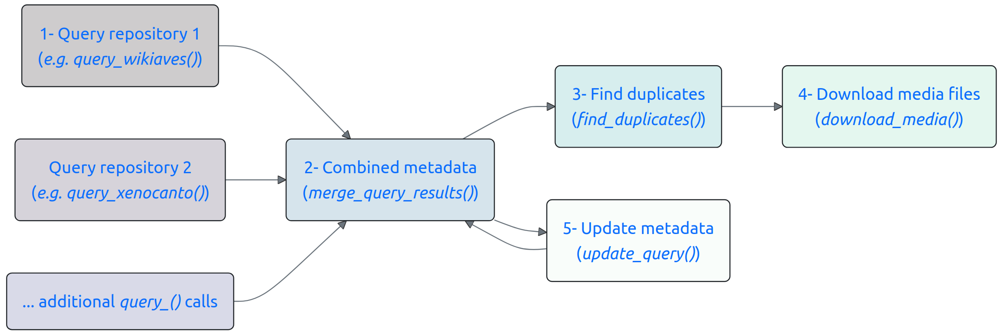
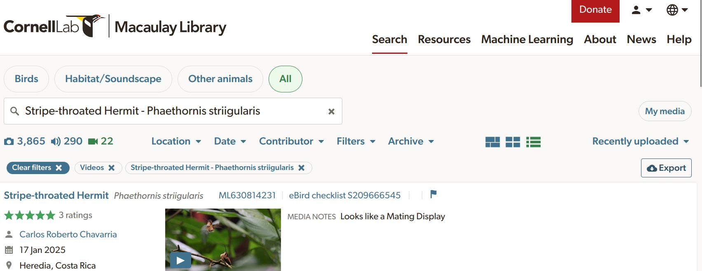
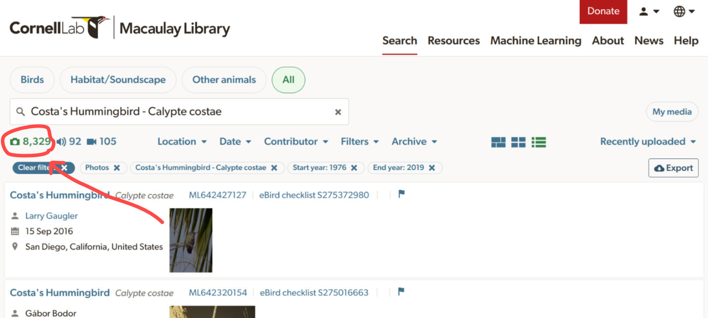

&nbsp;

```{r setup, eval = TRUE, echo = FALSE, message=FALSE}

library(knitr)
library(htmlwidgets)
library(suwo)

# Create custom printing method
.print_df <- function(x, highlight = NULL, ...) {
  kbl <- kableExtra::kable(
    head(as.data.frame(x)),
    align = "c",
    row.names = FALSE,
    format = "html",
    escape = FALSE
  )
  
  if (!is.null(highlight))
    kbl <- kableExtra::column_spec(
      kbl,
      column = which(names(x) %in% highlight),
      background = "#ccebff",
      bold = TRUE
    )
  
  kbl <- kableExtra::kable_styling(kbl, bootstrap_options = "striped", 
                                   font_size = 14)
  kbl <- kableExtra::scroll_box(kbl, width = "100%", height = "300px")
  
  asis_output(kbl)
}

# Register custom data frame print method
registerS3method("knit_print", "data.frame", .print_df)

# Global chunk options
knitr::opts_chunk$set(
  fig.width = 5,
  fig.height = 3.5,
  dpi = 70,
  comment = "",
  out.width = "80%",
  fig.align = "center",
  message = TRUE,
  warning = TRUE
)

options(width = 100, max.print = 100)

dir_tree <- function(path) {
  cat(gsub("\\[[0-9;]*[mK]", "", capture.output(fs::dir_tree(path))), 
      sep = "\n")
}
```


::: {.alert .alert-info}

The [suwo](https://github.com/maRce10/suwo) package aims to simplify the 
retrieval of nature media (mostly photos, audio files and videos) across 
multiple online biodiversity databases. This vignette provides an overview of 
the package’s core querying functions, the searching and downloading of media 
files, and the compilation of metadata from various sources. For detailed 
information on each function, please refer to the 
[function reference](https://maRce10.github.io/suwo/reference/index.html) 
or use the help files within R (e.g., `?query_gbif`).

:::


::: {.alert .alert-warning}

**Intended use and responsible practices**

The [suwo](https://github.com/maRce10/suwo) package is designed exclusively 
for non-commercial, scientific purposes, including research, education, and 
conservation. Any 
**commercial use of the data or media retrieved through this package is strictly prohibited** 
unless explicit, separate permission is granted directly from the original 
source platforms and content creators. Users are obligated to comply with the 
specific terms of service and data use policies of each source database, which 
often mandate attribution and similarly restrict commercial application. 
The package developers assume no liability for misuse of the retrieved data 
or violations of third-party terms of service.

:::


# Installation

```{r, eval = FALSE, echo = FALSE}

#Install from CRAN:

# From CRAN would be
install.packages("suwo")

#load package
library(suwo)


```

Install the latest development version from GitHub:

```{r, eval = FALSE}

# install package
remotes::install_github("maRce10/suwo")

#load packages
library(suwo)

```

# Basic workflow for obtaining nature media files

Finding data using [suwo](https://github.com/maRce10/suwo) follows a basic 
sequence. The following diagram illustrates this workflow and the main functions
involved:

<center></center>

</br>
Here is a description of each step:

1. Queries regarding a species are submitted through one of the available 
query functions (`query_repo_name()`) that connect to five different online 
repositories. The output of these queries is a data frame containing metadata 
associated with the media files (e.g., species name, date, location, etc, see below). 

1. If multiple repositories are queried, the resulting metadata data frames can 
be merged into a single data frame using the 
[merge_metadata()](https://marce10.github.io/suwo/reference/merge_metadata.html) function. 

1. Check for duplicate records in their datasets using the [find_duplicates()](https://marce10.github.io/suwo/reference/find_duplicates.html) function. Candidate duplicated entries are identified based on matching species name, country, date, user name, and 
geographic coordinates. User can double check the candidate duplicates and 
decide which records to keep, which can be done with [remove_duplicates()](https://marce10.github.io/suwo/reference/remove_duplicates.html).
 
1. Download the media files associated with the metadata using the [download_media()](https://marce10.github.io/suwo/reference/download_media.html) function. 

1. Users can update their datasets with new records using the [update_metadata()](https://marce10.github.io/suwo/reference/update_metadata.html) function. 


# Obtaining metadata: the query functions

The following table summarizes the available [suwo](https://github.com/maRce10/suwo) 
query functions and the types of metadata they retrieve:

```{r, echo=TRUE}
# Load suwo package
library(suwo)
```


```{r query_summary_table, echo=FALSE, results='asis', message=FALSE}

library(knitr)
library(kableExtra)

metadata_list <-  vignette_metadata <- suwo:::vignette_metadata

Repository <- sapply(metadata_list, function(x)
  x[1, "repository"])

names(metadata_list) <- tolower(Repository)

Function <- c(
  gbif = "query_gbif",
  inaturalist = "query_inaturalist",
  `macaulay library` =  "query_macaulay",
  observation = "query_observation",
  wikiaves = "query_wikiaves",
  `xeno-canto` = "query_xenocanto"
)

Function <- Function[match(names(metadata_list), names(Function))]


file_types <- sapply(Function, function(x)
  paste(formals(get(x))$format, collapse = ", "))
file_types <- gsub("c, ", "", file_types)
file_types[Function == "query_xenocanto"] <- "sound"

urls <- c(
  gbif = "https://www.gbif.org/",
  inaturalist = "https://www.inaturalist.org/",
  `macaulay library` =  "https://www.macaulaylibrary.org/",
  observation = "https://observation.org/",
  wikiaves = "https://www.wikiaves.com.br/",
  `xeno-canto` = "https://www.xeno-canto.org/"
)

urls <- urls[match(names(metadata_list), names(urls))]

token <- c(
  gbif = "No",
  inaturalist = "No",
  `macaulay library` =  "No",
  observation = "Yes",
  wikiaves = "No",
  `xeno-canto` = "Yes"
)

token <- token[match(names(metadata_list), names(token))]


tax_level <-  c(
  gbif = "Species",
  inaturalist = "Species",
  `macaulay library` =  "Species",
  observation = "Species",
  wikiaves = "Species",
  `xeno-canto` = "Species, subspecies, genus, family, group"
)

tax_level <- tax_level[match(names(metadata_list), names(tax_level))]

geo_cover <-  c(
  gbif = "Worldwide",
  inaturalist = "Worldwide",
  `macaulay library` =  "Worldwide",
  observation = "Worldwide",
  wikiaves = "Brazil",
  `xeno-canto` = "Worldwide"
)

geo_cover <- geo_cover[match(names(metadata_list), names(geo_cover))]

other <-  c(
  gbif = "Specify query by data base",
  inaturalist = NA,
  `macaulay library` =  "Interactive",
  observation = NA,
  wikiaves = NA,
  `xeno-canto` = "Specify query by taxonomy, geographic range and dates"
)

other <- other[match(names(metadata_list), names(other))]


colnames <- lapply(metadata_list, names)

colnames <- lapply(colnames, function(x)
  setdiff(x, suwo:::.format_query_output(only_basic_columns = TRUE)))

additional_data <- sapply(colnames, function(x)
  paste(x, collapse = ", "))

additional_data <- additional_data[match(names(metadata_list), names(additional_data))]

query_summary <- data.frame(
  Function = Function,
  Repository = Repository,
  `URL link` = urls,
  `File types` = file_types,
  `Requires api key` = token,
  `Taxonomic level` = tax_level,
  `Geographic coverage` = geo_cover,
  `Additional data` = additional_data,
  `Other features` = other,
  stringsAsFactors = FALSE,
  check.names = FALSE
)

# remove duplicates
query_summary <- query_summary[!duplicated(query_summary$Repository), ]

query_summary <- query_summary[order(query_summary$Repository),]

query_summary$`URL link` <- kableExtra::cell_spec(query_summary$`URL link`,
                                                  "html",
                                                  link = query_summary$`URL link`,
                                                  new_tab = TRUE)

query_summary$Function <- kableExtra::cell_spec(
  query_summary$Function,
  "html",
  link = paste0(
    "https://marce10.github.io/suwo/reference/",
    query_summary$Function,
    ".html"
  ),
  new_tab = TRUE
)

query_summary[, names(query_summary) != "Additional data"] |>
  kableExtra::kbl(
    caption = "Table 1: Summary of query functions.",
    format = "html",
    escape = FALSE,
    row.names = FALSE
  ) |>
  kableExtra::kable_styling(
    bootstrap_options = c("striped", "hover", "condensed", "responsive"),
    full_width = FALSE,
    position = "left"
  )

```

These are some example queries: 

1. Images of Sarapiqui Heliconia (_Heliconia sarapiquensis_) from iNaturalist (we print the first 4 rows of each output data frame):

```{r, eval = TRUE}
# Load suwo package
library(suwo)

h_sarapiquensis <- query_inaturalist(species = "Heliconia sarapiquensis", format = "image")

head(h_sarapiquensis, 4)
```

</br>

2.  Harpy eagles (_Harpia harpyja_) audio recordings from Wikiaves:

```{r, eval = FALSE}

h_harpyja <- query_wikiaves(species = "Harpia harpyja", format = "sound")

head(h_harpyja, 4)
```

```{r, echo=FALSE}

subset(vignette_metadata$h_harpyja, select = suwo:::.format_query_output(only_basic_columns = TRUE))

```

</br>

3. Common raccoon (_Procyon lotor_) videos from GBIF:

```{r, eval = FALSE}

p_lotor <- query_gbif(species = "Procyon lotor", format = "video")

head(p_lotor, 4)
```

```{r, echo=FALSE}

subset(vignette_metadata$p_lotor, select = suwo:::.format_query_output(only_basic_columns = TRUE))

```

</br>

--- 

By default all query function return the `r length(suwo:::.format_query_output(only_basic_columns = TRUE))` most basic metadata fields associated with the media files. Here is the definition of each field:

 - **repository**: Name of the repository
 - **format**: Type of media file (e.g., sound, photo, video)
 - **key**: Unique identifier of the media file in the repository
 - **species**: Species name associated with the media file (Note taxonomic authority may vary among repositories)
 - **date***: Date when the media file was recorded/photographed (in YYYY-MM-DD format or YYYY if only year is available)
 - **time***: Time when the media file was recorded/photographed (in HH:MM format)
 - **user_name***: Name of the user who uploaded the media file
 - **country***: Country where the media file was recorded/photographed
 - **locality***: Locality where the media file was recorded/photographed
 - **latitude***: Latitude of the location where the media file was recorded/photographed (in decimal degrees) 
 - **longitude***: Longitude of the location where the media file was recorded/photographed (in decimal degrees)
 - **file_url**: URL link to the media file (used to download media files)
 - **file_extension**: Extension of the media file (e.g., .mp3, .jpg, .mp4)
 
_* Can contain missing values (NAs)_

Users can also download all available metadata by setting the argument `all_data = TRUE`. These are the additional metadata fields, on top of the basic fields, that are retrieved by each query function:

```{r, echo=FALSE, results='asis', message=FALSE}

query_summary[, c("Function", "Additional data")] |>
  kableExtra::kbl(
    caption = "Table 2: Additional metadata per query function.",
    format = "html",
    escape = FALSE,
    row.names = FALSE
  ) |>
  kableExtra::kable_styling(
    bootstrap_options = c("striped", "hover", "condensed", "responsive"),
    full_width = FALSE,
    position = "left"
  )

```

<div class="alert alert-warning">

**Obtaining raw data**

By default the package standardizes the information in the basic fields (detailed above) in order to facilitate the compilation of metadata from multiple repositories. However, in some cases this may result in loss of information. For instance, some repositories allow users to provide "morning" as a valid time value, which are converted into NAs by [suwo](https://github.com/maRce10/suwo). In such cases, users can retrieve the original data by setting the `raw_data = TRUE` in the query functions and/or global options (`options(raw_data = TRUE)`). Note that subsequent data manipulation functions (e.g., [merge_metadata()](https://marce10.github.io/suwo/reference/merge_metadata.html), [find_duplicates()](https://marce10.github.io/suwo/reference/find_duplicates.html), etc) will not work properly as the basic fields are not standardized.

</div>

The code above examplifies the most common use of query functions, which applies also to the function [query_gbif()](https://marce10.github.io/suwo/reference/query_gbif.html). The following sections provide more details on the two query functions that require special considerations: [query_macaulay()](https://marce10.github.io/suwo/reference/query_macaulay.html) and [query_xenocanto()](https://marce10.github.io/suwo/reference/query_xenocanto.html).    

## query_macaulay()

### Interactive retrieval of metadata

[query_macaulay()](https://marce10.github.io/suwo/reference/query_macaulay.html) is the only interactive function. This means that when users run a query the function opens a browser window to the [Macaulay Library's search page](https://search.macaulaylibrary.org/catalog), where the users must download a .csv file with the metadata. Here is a example of a query for strip-throated hermit (_Phaethornis striigularis_) videos:

```{r, eval = FALSE}
p_striigularis <- query_macaulay(species = "Phaethornis striigularis", format = "video")
```

Users must click on the "Export" button to save the .csv file with the metadata: 

<center></center>

</br>

Here are some tips for using this function properly:

* The file must be saved in the directory specified by the `path` argument of the function (default is the current working directory)
* If the file is saved overwriting a pre-existing file (i.e. same file name) the function will not detect it
* The function will not proceed until the file is saved 
* Users must log in to the Macaulay Library/eBird account in order to access large batches of observations

After saving the file, the function will read the file and return a data frame with the metadata. Here we print the first 4 rows of the output data frame:

```{r, eval=FALSE}
head(p_striigularis, 4)
```

```{r, echo=FALSE}

subset(vignette_metadata$p_striigularis, select = suwo:::.format_query_output(only_basic_columns = TRUE))

```

### Bypassing record limit

Even if logged in, a maximum of 10000 records per query can be returned. This can be bypassed by using the 'dates' argument to split the search into a sequence of shorter date ranges. The rationale is that by splitting the search into date ranges, users can download multiple .csv files, which are then combined by the function into a single metadata data frame. Of course users must download the csv for each data range.  The following code looks for photos of costa's hummingbird (_Calypte costae_). As Macaulay Library hosts more than 30000 costa's hummingbird records, we need to split the query into multiple date ranges:

```{r, eval = FALSE}
# test a query with more than 10000 results paging by date
cal_cos <- query_macaulay(
  species = "Calypte costae",
  format = "image",
  path = tempdir(),
  dates = c(1976, 2019, 2022, 2024, 2025, 2026)
)
```

Users can check at the Macaulay Library website how many records are available for their species of interest (see image below) and then decide how to split the search by date ranges accordingly so each sub-query has less than 10000 records. 

<center></center>

## query_xenocanto()

### API key

[Xeno-Canto](https://www.xeno-canto.org/) requires users to obtain a free API key to use [their API v3](https://xeno-canto.org/admin.php/explore/api). Users can get their API key by creating an account at [Xeno-Canto's registering page](https://xeno-canto.org/auth/register). Once users have their API key, they can use it in the [query_xenocanto()](https://marce10.github.io/suwo/reference/query_xenocanto.html) function by providing it as the `api_key` argument. Here is an example of a query for Spix's disc-winged bat (_Thyroptera tricolor_) audio recordings:

```{r, eval = FALSE}

# replace "YOUR_XC_API_KEY" with your key
t_tricolor <- query_xenocanto(species = "Thyroptera tricolor", api_key = "YOUR_XC_API_KEY")

head(t_tricolor, 4)
```

```{r, echo=FALSE}

subset(vignette_metadata$t_tricolor, select = suwo:::.format_query_output(only_basic_columns = TRUE))
```

## Special queries

[query_xenocanto()](https://marce10.github.io/suwo/reference/query_xenocanto.html) allows users to perform special queries by specifying additional query tags. Users can also search by country, taxonomy (taxonomic group, family, genus, subspecies), geography (country, location, geographic coordinates)  date, sound type (e.g. female song, calls) and recording properties (quality, length, sampling rate) ([see list of available tags here](https://xeno-canto.org/admin.php/explore/api#examples)). Here is an example of a query for audio recordings of pale-striped poison frog (_Ameerega hahneli_, 'sp:"Ameerega hahneli") from French Guiana (cnt:"French Guiana") and with the highest recording quality (q:"A"):


```{r, eval = FALSE}

# replace "YOUR_XC_API_KEY" with your key
a_hahneli <- query_xenocanto(species = 'sp:"Ameerega hahneli" cnt:"French Guiana" q:"A"', api_key = "YOUR_XC_API_KEY")

head(a_hahneli, 4)
```

```{r, echo=FALSE}

subset(vignette_metadata$a_hahneli, select = suwo:::.format_query_output(only_basic_columns = TRUE))
```

# Update metadata

The [update_metadata()](https://marce10.github.io/suwo/reference/update_metadata.html) function allows users to update a previous query to add new information from the corresponding repository of the original search. This function takes as input a data frame previously obtained from any query function (i.e. `query_reponame()`) and returns a data frame similar to the input with new data appended. 

To show case the function, we first query metadata of Eisentraut's Bow-winged Grasshopper sounds from iNaturalist. Let's assume that the initial query was done a while ago and we want to update it to include any new records that might have been added since then. The following code removes all observations recorded after 2024-12-31 to simulate an old query:


```{r}
# initial query
c_eisentrauti <- query_inaturalist(species = "Chorthippus eisentrauti")

head(c_eisentrauti, 4)

# exclude new observations (simulate old data)
old_c_eisentrauti <- c_eisentrauti[c_eisentrauti$date <= "2024-12-31" | is.na(c_eisentrauti$date), ]

# update "old" data
upd_c_eisentrauti <- update_metadata(metadata = old_c_eisentrauti)

# compare number of records
nrow(old_c_eisentrauti) == nrow(upd_c_eisentrauti)

```

# Combine metadata from multiple repositories

The [merge_metadata()](https://marce10.github.io/suwo/reference/merge_metadata.html) function allows users to combine metadata data frames obtained from multiple query functions into a single data frame. The function will match the basic columns of all data frames. Data from additional columns (for instance when using `all_data = TRUE` in the query) will only be combined if the column names from different repositories match. The function will return a data frame that includes a new column called `source` indicating the name of the original metadata data frame: 

```{r, eval = FALSE}

truf_xc <- query_xenocanto(species = "Turdus rufiventris",
                             format = "sound",
                             api_key = "YOUR_XC_API_KEY")
truf_gbf <- query_gbif(species = "Turdus rufiventris", format = "sound")
truf_ml <- query_macaulay(species = "Turdus rufiventris",
                          format = "sound",
                          path = tempdir())

# merge metadata
merged_metadata <- merge_metadata(truf_xc, truf_gbf, truf_ml)

head(merged_metadata, 4)
```

```{r, echo=FALSE}

merged_metadata <- suwo:::merged_metadata

head(merged_metadata, 4)

```

Note that in such a multi-repository query, all query functions use the same search species (i.e. species name) and media format (e.g., sound, image, video). To facilitate this, users can set the global options `species` and `format` so they do not need to specify them in each query function:

```{r, eval = FALSE}

options(species = "Turdus rufiventris", format = "sound")
truf_xc <- query_xenocanto(api_key = "YOUR_XC_API_KEY")
truf_gbf <- query_gbif()
truf_ml <- query_macaulay(path = tempdir())

# merge metadata
merged_metadata <- merge_metadata(truf_xc, truf_gbf, truf_ml)

```


# Find and remove duplicated records

When compiling data from multiple repositories, duplicated media records are a common issue. These duplicates occur both through data sharing between repositories like Xeno-Canto and GBIF, and when users upload the same file to multiple platforms. To help users efficiently identify these duplicate records, [suwo](https://github.com/maRce10/suwo) provides the [find_duplicates()](https://marce10.github.io/suwo/reference/find_duplicates.html)    function.

The [find_duplicates()](https://marce10.github.io/suwo/reference/find_duplicates.html) function helps users identify potential duplicate records in their metadata data frames. Duplicates are identified based on matching species name, country, date, user name, and locality. The function uses a fuzzy matching approach to account for minor variations in the data (e.g., typos, different location formats, etc).The output is a data frame with the candidate duplicate records, allowing users to review and decide which records to keep.

In this example we look for possible duplicates in the merged metadata data frame from the previous section:

```{r, eval = TRUE}
# find duplicates
dups_merged_metadata <- find_duplicates(merged_metadata)

# look first 6 columns
head(dups_merged_metadata)
```

```{r, echo=FALSE}

boesman_group <- dups_merged_metadata$duplicate_group[dups_merged_metadata$key== 273100]

# Define display function
display_code <- function(value) {
  paste0("subset(dups_merged_metadata, duplicate_group == ", value, ")")
    }
```

Note that the [find_duplicates()](https://marce10.github.io/suwo/reference/find_duplicates.html) function adds a new column called "duplicate_group" to the output data frame. This column assigns a unique identifier to each group of potential duplicates, allowing users to easily identify and review them. For instance, in the example above, records from duplicated group `r boesman_group` belong to the same user, were recorded on the same date and time and in the same country:

```{r, code = display_code(boesman_group)}
subset(dups_merged_metadata, duplicate_group == boesman_group)
```


Also note that the locality is not exactly the same for these records, but the fuzzy matching approach used by [find_duplicates()](https://marce10.github.io/suwo/reference/find_duplicates.html) was able to identify them as potential duplicates.

Once users have reviewed the candidate duplicates, they can use the [remove_duplicates()](https://marce10.github.io/suwo/reference/remove_duplicates.html) function to eliminate unwanted duplicates from their metadata data frames. This function takes as input a metadata data frame (either the original query results or the output of [find_duplicates()](https://marce10.github.io/suwo/reference/find_duplicates.html)) and a vector of row numbers indicating which records to remove:


```{r}
# remove duplicates
dedup_metadata <- remove_duplicates(dups_merged_metadata)
```


The output is a data frame similar to the input but without the specified duplicate records:
```{r}
# look at first 4 columns of deduplicated metadata
head(dedup_metadata, 4)
```

When duplicates are found, one observation from each group of duplicates is retained in the output data frame. However, if multiple observations from the same repository are labeled as duplicates, by default (`same_repo = FALSE`) all of them are retained in the output data frame. This is useful as it can be expected that observations from the same repository are not true duplicates (e.g. different recordings uploaded to Xeno-Canto with the same date, time and location by the same user), but rather have not been documented with enough precision to be told apart. This behavior can be modified. If `same_repo = TRUE`, only one of the duplicated observations from the same repository will be retained in the output data frame (and all other excluded). The function will give priority to repositories in which media downloading is more straightforward (i.e. Xeno-Canto, GBIF), but this can be modified with the argument 'repo_priority'.

# Download media files

The last step of the workflow is to download the media files associated with the metadata. This can be done using the [download_media()](https://marce10.github.io/suwo/reference/download_media.html) function, which takes as input a metadata data frame (obtained from any query function or any of the other metadata managing functions) and downloads the media files to a specified directory. For this example we will download images from a query on zambian slender Caesar (_Amanita zambiana_) (a mushroom) on GBIF:

```{r, eval = TRUE}

# query GBIF for Amanita zambiana images
a_zam <- query_gbif(species = "Amanita zambiana", format = "image")

# create folder for images
out_folder <- file.path(tempdir(), "amanita_zambiana")
dir.create(out_folder)

# download media files to a temporary directory
azam_files <- download_media(metadata = a_zam, path = out_folder)

```

The output of the function is a data frame similar to the input metadata but with two additional columns indicating the file name of the downloaded files ('downloaded_file_name') and the result of the download attempt ('download_status', with values "success", 'failed', 'already there (not downloaded)' or 'overwritten').

Here we print the first 4 rows of the output data frame:

```{r, eval = TRUE}

head(azam_files, 4)

```

... and check that the files were saved in the path supplied:
```{r, eval = FALSE}

fs::dir_tree(path = out_folder)

```

```{r, echo=FALSE}

dir_tree(path = out_folder)

```

Note that the name of the downloaded files includes the species name, an abbreviation of the repository name and the unique record key. If more than one media file is associated with a record, a sequential number is added at the end of the file name.


This is a multipanel plot of 6 of the downloaded images (just for illustration purpose):
```{r}
# create a 6 pannel plot of the downloaded images
par(mfrow = c(2, 3), mar = c(1, 1, 2, 1))

for (i in 1:6) {
  img <- jpeg::readJPEG(file.path(out_folder, azam_files$downloaded_file_name[i]))
  plot(
    1:2,
    type = 'n',
    axes = FALSE
  )
  rasterImage(img, 1, 1, 2, 2)
  title(main = paste(
    azam_files$country[i],
    azam_files$date[i],
    sep = "\n"
  ))
}

```

```{r, echo=FALSE}
unlink(out_folder, recursive = TRUE)
```

Users can also save the downloaded files into sub-directories with the argument `folder_by`. This argument takes a character of factor column with the names of a metadata field (a column in the metadata data frame) to create sub-directories within the main download directory (suplied with the argument `path`). For instance, the following code searches/downloads images of longspined porcupinefish (_Diodon holocanthus_) from GBIF, and saves images into sub-directories by country (for simplicity only 6 of them):
    
```{r, eval = FALSE}

# query GBIF for longspined porcupinefish images
d_holocanthus <- query_gbif(species = "Diodon holocanthus", format = "image")

# keep only JPEG records (for simplicity for this vignette)
d_holocanthus <- d_holocanthus[d_holocanthus$file_extension == "jpeg", ]

# select 6 random JPEG records
set.seed(666)
d_holocanthus <- d_holocanthus[sample(1:nrow(d_holocanthus), 6),]

# create folder for images
out_folder <- file.path(tempdir(), "diodon_holocanthus")
dir.create(out_folder)

# download media files creating sub-directories by country
dhol_files <- download_media(metadata = d_holocanthus,
                             path = out_folder,
                             folder_by = "country")

```

```{r, echo = FALSE}

d_holocanthus <- vignette_metadata$d_holocanthus

# create folder for images
out_folder <- file.path(tempdir(), "diodon_holocanthus")
dir.create(out_folder)

# download media files creating sub-directories by country
dhol_files <- download_media(metadata = d_holocanthus,
                             path = out_folder,
                             folder_by = "country")
```

```{r, eval=FALSE}

fs::dir_tree(path = out_folder)

```

```{r, echo=FALSE}

dir_tree(path = out_folder)

```

In such case the 'downloaded_file_name' column will include the sub-directory name:
```{r}

dhol_files$downloaded_file_name

```

This is a multipanel plot of 6 of the downloaded images (just for fun):
```{r}
# create a 6 pannel plot of the downloaded images
par(mfrow = c(2, 3), mar = c(1, 1, 2, 1))

for (i in 1:6) {
  img <- jpeg::readJPEG(file.path(out_folder, dhol_files$downloaded_file_name[i]))
  plot(
    1:2,
    type = 'n',
    axes = FALSE
  )
  rasterImage(img, 1, 1, 2, 2)
  title(main = paste(
    dhol_files$country[i],
    dhol_files$date[i],
    sep = "\n"
  ))
}

```

```{r, echo=FALSE}
unlink(out_folder, recursive = TRUE)
```

<!-- add packages used, system details and versions  -->

## Session information {.unnumbered .unlisted}

<details>
  <summary>Click to see</summary>
```{r session info}
#| echo: false

# if devtools is installed use devtools::session_info()
if (requireNamespace("devtools", quietly = TRUE)) {
  devtools::session_info()
} else {
  sessionInfo()
}

```
</details>
