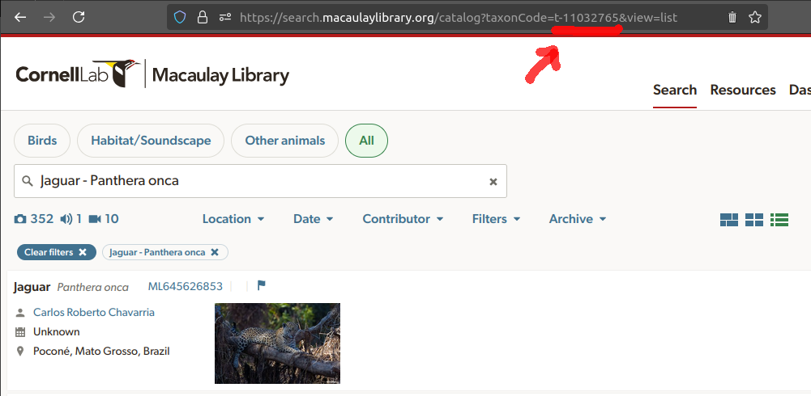
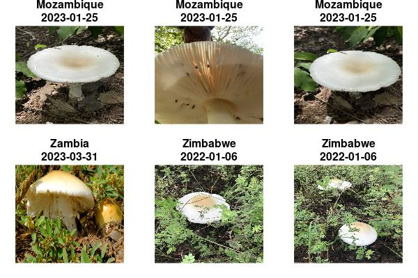
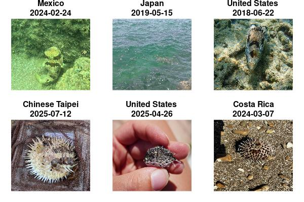

&nbsp;


::: {.alert .alert-info}

The [suwo](https://marce10.github.io/suwo/) package aims to simplify the
retrieval of nature media (mostly photos, audio files and videos) across
multiple online biodiversity databases. This vignette provides an overview of
the package’s core querying functions, the searching and downloading of media
files, and the compilation of metadata from various sources. For detailed
information on each function, please refer to the
[function reference](https://maRce10.github.io/suwo/reference/index.html)
or use the help files within R (e.g., `?query_gbif`).

:::

::: {.alert .alert-warning}

**Intended use and responsible practices**

This package is designed exclusively for non-commercial, scientific purposes, including research, education, and conservation. **Commercial use of data or media retrieved through this package is the user’s responsibility and is allowed only when the applicable license of the source database explicitly permits such use, or when explicit, separate permission has been obtained directly from the original source platforms or rights holders**. Users must comply with the specific terms of service and data-use policies of each source database, which may require attribution and may further restrict commercial application. The package developers assume no liability for misuse of the retrieved data or for violations of third-party terms of service.

:::

# Installation


Install the latest development version from GitHub:


``` r
# install package
remotes::install_github("maRce10/suwo")

#load packages
library(suwo)
```

# Basic workflow for obtaining nature media files

Obtaining nature media using [suwo](https://marce10.github.io/suwo/) follows a basic
sequence. The following diagram illustrates this workflow and the main functions
involved:

<center></center>

</br>
Here is a description of each step:

Obtain metadata:

1. Queries regarding a species are submitted through one of the available
query functions (`query_repo_name()`) that connect to five different online
repositories (Xeno-Canto, Inaturalist, GBIF, Macaulay Library and WikiAves). The output of these queries is a data frame containing metadata
associated with the media files (e.g., species name, date, location, etc, see below).

Curate metadata:

1. If multiple repositories are queried, the resulting metadata data frames can
be merged into a single data frame using the
[merge_metadata()](https://marce10.github.io/suwo/reference/merge_metadata.html) function.

1. Check for duplicate records in their datasets using the [find_duplicates()](https://marce10.github.io/suwo/reference/find_duplicates.html) function. Candidate duplicated entries are identified based on matching species name, country, date, user name, and
geographic coordinates. User can double check the candidate duplicates and
decide which records to keep, which can be done with [remove_duplicates()](https://marce10.github.io/suwo/reference/remove_duplicates.html).

1. Download the media files associated with the metadata using the [download_media()](https://marce10.github.io/suwo/reference/download_media.html) function.

1. Users can update their datasets with new records using the [update_metadata()](https://marce10.github.io/suwo/reference/update_metadata.html) function.


# Obtaining metadata: the query functions

The following table summarizes the available [suwo](https://marce10.github.io/suwo/)
query functions and the types of metadata they retrieve:


``` r
# Load suwo package
library(suwo)
```

<table class="table table-striped table-hover table-condensed table-responsive" style="width: auto !important; ">
<caption>Table 1: Summary of query functions and the associated repositories.</caption>
 <thead>
  <tr>
   <th style="text-align:left;"> Function </th>
   <th style="text-align:left;"> Repository </th>
   <th style="text-align:left;"> URL link </th>
   <th style="text-align:left;"> File types </th>
   <th style="text-align:left;"> Requires api key </th>
   <th style="text-align:left;"> Taxonomic level </th>
   <th style="text-align:left;"> Geographic coverage </th>
   <th style="text-align:left;"> Taxonomic coverage </th>
   <th style="text-align:left;"> Other features </th>
  </tr>
 </thead>
<tbody>
  <tr>
   <td style="text-align:left;"> <a href="https://marce10.github.io/suwo/reference/query_gbif.html" style="     " target="_blank">query_gbif</a> </td>
   <td style="text-align:left;"> GBIF </td>
   <td style="text-align:left;"> <a href="https://www.gbif.org/" style="     " target="_blank">https://www.gbif.org/</a> </td>
   <td style="text-align:left;"> image, sound, video, interactive resource </td>
   <td style="text-align:left;"> No </td>
   <td style="text-align:left;"> Species </td>
   <td style="text-align:left;"> Global </td>
   <td style="text-align:left;"> All life </td>
   <td style="text-align:left;"> Specify query by data base </td>
  </tr>
  <tr>
   <td style="text-align:left;"> <a href="https://marce10.github.io/suwo/reference/query_inaturalist.html" style="     " target="_blank">query_inaturalist</a> </td>
   <td style="text-align:left;"> iNaturalist </td>
   <td style="text-align:left;"> <a href="https://www.inaturalist.org/" style="     " target="_blank">https://www.inaturalist.org/</a> </td>
   <td style="text-align:left;"> image, sound </td>
   <td style="text-align:left;"> No </td>
   <td style="text-align:left;"> Species </td>
   <td style="text-align:left;"> Global </td>
   <td style="text-align:left;"> All life </td>
   <td style="text-align:left;">  </td>
  </tr>
  <tr>
   <td style="text-align:left;"> <a href="https://marce10.github.io/suwo/reference/query_macaulay.html" style="     " target="_blank">query_macaulay</a> </td>
   <td style="text-align:left;"> Macaulay Library </td>
   <td style="text-align:left;"> <a href="https://www.macaulaylibrary.org/" style="     " target="_blank">https://www.macaulaylibrary.org/</a> </td>
   <td style="text-align:left;"> image, sound, video </td>
   <td style="text-align:left;"> No </td>
   <td style="text-align:left;"> Species </td>
   <td style="text-align:left;"> Global </td>
   <td style="text-align:left;"> Mostly birds but also other vertebrates and
  invertebrates </td>
   <td style="text-align:left;"> Interactive </td>
  </tr>
  <tr>
   <td style="text-align:left;"> <a href="https://marce10.github.io/suwo/reference/query_wikiaves.html" style="     " target="_blank">query_wikiaves</a> </td>
   <td style="text-align:left;"> WikiAves </td>
   <td style="text-align:left;"> <a href="https://www.wikiaves.com.br/" style="     " target="_blank">https://www.wikiaves.com.br/</a> </td>
   <td style="text-align:left;"> image, sound </td>
   <td style="text-align:left;"> No </td>
   <td style="text-align:left;"> Species </td>
   <td style="text-align:left;"> Brazil </td>
   <td style="text-align:left;"> Birds </td>
   <td style="text-align:left;">  </td>
  </tr>
  <tr>
   <td style="text-align:left;"> <a href="https://marce10.github.io/suwo/reference/query_xenocanto.html" style="     " target="_blank">query_xenocanto</a> </td>
   <td style="text-align:left;"> Xeno-Canto </td>
   <td style="text-align:left;"> <a href="https://www.xeno-canto.org/" style="     " target="_blank">https://www.xeno-canto.org/</a> </td>
   <td style="text-align:left;"> sound </td>
   <td style="text-align:left;"> Yes </td>
   <td style="text-align:left;"> Species, subspecies, genus, family, group </td>
   <td style="text-align:left;"> Global </td>
   <td style="text-align:left;"> Birds, frogs, non-marine mammals and grasshoppers </td>
   <td style="text-align:left;"> Specify query by taxonomy, geographic range and dates </td>
  </tr>
</tbody>
</table>

These are some example queries:

1. Images of Sarapiqui Heliconia (_Heliconia sarapiquensis_) from iNaturalist (we print the first 4 rows of each output data frame):


``` r
# Load suwo package
library(suwo)

h_sarapiquensis <- query_inaturalist(species = "Heliconia sarapiquensis",
                                     format = "image")
```

```
✔ Obtaining metadata (29 matching records found) 🎊
```

``` r
head(h_sarapiquensis, 4)
```

```
   repository format       key                 species       date  time               user_name
1 iNaturalist  image 330280680 Heliconia sarapiquensis 2025-12-08 13:47 Carlos g Velazco-Macias
2 iNaturalist  image 330280680 Heliconia sarapiquensis 2025-12-08 13:47 Carlos g Velazco-Macias
3 iNaturalist  image 330280680 Heliconia sarapiquensis 2025-12-08 13:47 Carlos g Velazco-Macias
4 iNaturalist  image 263417773 Heliconia sarapiquensis 2025-02-28 14:23        Original Madness
  country                    locality latitude longitude
1      NA    10.159645,-83.9378766667 10.15964 -83.93788
2      NA    10.159645,-83.9378766667 10.15964 -83.93788
3      NA    10.159645,-83.9378766667 10.15964 -83.93788
4      NA 10.163116739,-83.9389050007 10.16312 -83.93891
                                                                       file_url file_extension
1  https://inaturalist-open-data.s3.amazonaws.com/photos/598874322/original.jpg           jpeg
2  https://inaturalist-open-data.s3.amazonaws.com/photos/598874346/original.jpg           jpeg
3  https://inaturalist-open-data.s3.amazonaws.com/photos/598874381/original.jpg           jpeg
4 https://inaturalist-open-data.s3.amazonaws.com/photos/473219810/original.jpeg           jpeg
```

</br>

2.  Harpy eagles (_Harpia harpyja_) audio recordings from WikiAves:


``` r
h_harpyja <- query_wikiaves(species = "Harpia harpyja", format = "sound")
```

```
✔ Obtaining metadata (78 matching records found) 🌈
```

``` r
head(h_harpyja, 4)
```

```
  repository format     key        species       date time         user_name country
1   WikiAves  sound   25867 Harpia harpyja       <NA> <NA> Gustavo Pedersoli  Brazil
2   WikiAves  sound 2701424 Harpia harpyja 2020-10-20 <NA>        Bruno Lima  Brazil
3   WikiAves  sound  878999 Harpia harpyja 2013-03-20 <NA>   Thiago Silveira  Brazil
4   WikiAves  sound 3027120 Harpia harpyja 2016-06-20 <NA>       Ciro Albano  Brazil
          locality latitude longitude
1 Alta Floresta/MT       NA        NA
2      Itanhaém/SP       NA        NA
3 Alta Floresta/MT       NA        NA
4       Camacan/BA       NA        NA
                                                                                                     file_url
1     https://s3.amazonaws.com/media.wikiaves.com.br/recordings/52/25867_a73f0e8da2179e82af223ff27f74a912.mp3
2 https://s3.amazonaws.com/media.wikiaves.com.br/recordings/1072/2701424_e0d533b952b64d6297c4aff21362474b.mp3
3   https://s3.amazonaws.com/media.wikiaves.com.br/recordings/878/878999_c1f8f4ba81fd597548752e92f1cdba50.mp3
4 https://s3.amazonaws.com/media.wikiaves.com.br/recordings/7203/3027120_5148ce0fed5fe99aba7c65b2f045686a.mp3
  file_extension
1            mp3
2            mp3
3            mp3
4            mp3
```


</br>

3. Common raccoon (_Procyon lotor_) videos from GBIF:


``` r
p_lotor <- query_gbif(species = "Procyon lotor", format = "video")
```

```
✔ Obtaining metadata (13 matching records found) 😸
```

``` r
head(p_lotor, 4)
```

```
  repository format        key       species       date time user_name    country locality latitude
1       GBIF  video 3501153129 Procyon lotor 2015-07-21 <NA>      <NA> Luxembourg       NA  49.7733
2       GBIF  video 3501153135 Procyon lotor 2015-07-04 <NA>      <NA> Luxembourg       NA  49.7733
3       GBIF  video 3501153159 Procyon lotor 2015-07-04 <NA>      <NA> Luxembourg       NA  49.7733
4       GBIF  video 3501153162 Procyon lotor 2015-07-04 <NA>      <NA> Luxembourg       NA  49.7733
  longitude
1   5.94092
2   5.94092
3   5.94092
4   5.94092
                                                                                       file_url
1 https://archimg.mnhn.lu/Observations/Taxons/Biomonitoring/063_094_S2_K2_20150721_063004AM.mp4
2 https://archimg.mnhn.lu/Observations/Taxons/Biomonitoring/063_094_S2_K1_20150704_072418AM.mp4
3 https://archimg.mnhn.lu/Observations/Taxons/Biomonitoring/063_094_S2_K1_20150704_072402AM.mp4
4 https://archimg.mnhn.lu/Observations/Taxons/Biomonitoring/063_094_S2_K1_20150704_072346AM.mp4
  file_extension
1            m4a
2            m4a
3            m4a
4            m4a
```

</br>

---

By default all query function return the 13 most basic metadata fields associated with the media files. Here is the definition of each field:

 - **repository**: Name of the repository
 - **format**: Type of media file (e.g., sound, photo, video)
 - **key**: Unique identifier of the media file in the repository
 - **species**: Species name associated with the media file (Note taxonomic authority may vary among repositories)
 - **date***: Date when the media file was recorded/photographed (in YYYY-MM-DD format or YYYY if only year is available)
 - **time***: Time when the media file was recorded/photographed (in HH:MM format)
 - **user_name***: Name of the user who uploaded the media file
 - **country***: Country where the media file was recorded/photographed
 - **locality***: Locality where the media file was recorded/photographed
 - **latitude***: Latitude of the location where the media file was recorded/photographed (in decimal degrees)
 - **longitude***: Longitude of the location where the media file was recorded/photographed (in decimal degrees)
 - **file_url**: URL link to the media file (used to download media files)
 - **file_extension**: Extension of the media file (e.g., .mp3, .jpg, .mp4)

_* Can contain missing values (NAs)_

Users can also download all available metadata by setting the argument `all_data = TRUE`. These are the additional metadata fields, on top of the basic fields, that are retrieved by each query function:

<table class="table table-striped table-hover table-condensed table-responsive" style="width: auto !important; ">
<caption>Table 2: Additional metadata per query function.</caption>
 <thead>
  <tr>
   <th style="text-align:left;"> Function </th>
   <th style="text-align:left;"> Additional data </th>
  </tr>
 </thead>
<tbody>
  <tr>
   <td style="text-align:left;"> <a href="https://marce10.github.io/suwo/reference/query_gbif.html" style="     " target="_blank">query_gbif</a> </td>
   <td style="text-align:left;"> datasetkey, publishingorgkey, installationkey, hostingorganizationkey, publishingcountry, protocol, lastcrawled, lastparsed, crawlid, basisofrecord, occurrencestatus, taxonkey, kingdom_code, phylum_code, class_code, order_code, family_key, genus_code, species_code, acceptedtaxonkey, scientificnameauthorship, acceptedscientificname, kingdom, phylum, order, family, genus, genericname, specific_epithet, taxonrank, taxonomicstatus, iucnredlistcategory, continent, year, month, day, startdayofyear, enddayofyear, lastinterpreted, license, organismquantity, organismquantitytype, issequenced, isincluster, datasetname, recordist, identifiedby, samplingprotocol, geodeticdatum, class, countrycode, gbifregion, publishedbygbifregion, recordnumber, identifier, habitat, institutionid, verbatimeventdate, dynamicproperties, verbatimcoordinatesystem, eventremarks, gbifid, collectioncode, occurrenceid, institutioncode, identificationqualifier, media_type, page, state_province, comments </td>
  </tr>
  <tr>
   <td style="text-align:left;"> <a href="https://marce10.github.io/suwo/reference/query_inaturalist.html" style="     " target="_blank">query_inaturalist</a> </td>
   <td style="text-align:left;"> quality_grade, taxon_geoprivacy, uuid, cached_votes_total, identifications_most_agree, species_guess, identifications_most_disagree, positional_accuracy, comments_count, site_id, created_time_zone, license_code, observed_time_zone, public_positional_accuracy, oauth_application_id, created_at, description, time_zone_offset, observed_on, observed_on_string, updated_at, captive, faves_count, num_identification_agreements, identification_disagreements_count, map_scale, uri, community_taxon_id, owners_identification_from_vision, identifications_count, obscured, num_identification_disagreements, geoprivacy, spam, mappable, identifications_some_agree, place_guess, id, license_code_1, attribution, hidden </td>
  </tr>
  <tr>
   <td style="text-align:left;"> <a href="https://marce10.github.io/suwo/reference/query_macaulay.html" style="     " target="_blank">query_macaulay</a> </td>
   <td style="text-align:left;"> common_name, background_species, caption, year, month, day, country_state_county, state_province, county, age_sex, behavior, playback, captive, collected, specimen_id, home_archive_catalog_number, recorder, microphone, accessory, partner_institution, ebird_checklist_id, unconfirmed, air_temp__c_, water_temp__c_, media_notes, observation_details, parent_species, species_code, taxon_category, taxonomic_sort, recordist_2, average_community_rating, number_of_ratings, asset_tags, original_image_height, original_image_width </td>
  </tr>
  <tr>
   <td style="text-align:left;"> <a href="https://marce10.github.io/suwo/reference/query_wikiaves.html" style="     " target="_blank">query_wikiaves</a> </td>
   <td style="text-align:left;"> user_id, species_code, common_name, repository_id, verified, locality_id, number_of_comments, likes, visualizations, duration </td>
  </tr>
  <tr>
   <td style="text-align:left;"> <a href="https://marce10.github.io/suwo/reference/query_xenocanto.html" style="     " target="_blank">query_xenocanto</a> </td>
   <td style="text-align:left;"> genus, specific_epithet, subspecies, taxonomic_group, english_name, altitude, vocalization_type, sex, stage, method, url, uploaded_file, license, quality, length, upload_date, other_species, comments, animal_seen, playback_used, temp, regnr, auto, recorder, microphone, sampling_rate, sonogram_small, sonogram_med, sonogram_large, sonogram_full, oscillogram_small, oscillogram_med, oscillogram_large, sonogram </td>
  </tr>
</tbody>
</table>

<div class="alert alert-warning">

**Obtaining raw data**

By default the package standardizes the information in the basic fields (detailed above) in order to facilitate the compilation of metadata from multiple repositories. However, in some cases this may result in loss of information. For instance, some repositories allow users to provide "morning" as a valid time value, which are converted into NAs by [suwo](https://marce10.github.io/suwo/). In such cases, users can retrieve the original data by setting the `raw_data = TRUE` in the query functions and/or global options (`options(raw_data = TRUE)`). Note that subsequent data manipulation functions (e.g., [merge_metadata()](https://marce10.github.io/suwo/reference/merge_metadata.html), [find_duplicates()](https://marce10.github.io/suwo/reference/find_duplicates.html), etc) will not work as the basic fields are not standardized.

</div>

The code above examplifies the most common use of query functions, which applies also to the function [query_gbif()](https://marce10.github.io/suwo/reference/query_gbif.html). The following sections provide more details on the two query functions that require special considerations: [query_macaulay()](https://marce10.github.io/suwo/reference/query_macaulay.html) and [query_xenocanto()](https://marce10.github.io/suwo/reference/query_xenocanto.html).

## query_macaulay()

### Interactive retrieval of metadata

[query_macaulay()](https://marce10.github.io/suwo/reference/query_macaulay.html) is the only interactive function.  This means that when users run a query the function opens a browser window to the [Macaulay Library's search page](https://search.macaulaylibrary.org/catalog), where the users must download a .csv file with the metadata. Here is a example of a query for strip-throated hermit (_Phaethornis striigularis_) videos:


``` r
p_striigularis <- query_macaulay(species = "Phaethornis striigularis",
                                 format = "video")
```

```
A browser will open the macaulay library website. Save the .csv file ('export' button) to this directory: /home/m/Dropbox/R_package_testing/suwo/vignettes/
(R is monitoring for new CSV files. Press ESC to stop the function)
File:  ML__2026-02-10T16-08_stther2_video.csv 
```

```
✔ 24 matching records found 🎉
```

Users must click on the "Export" button to save the .csv file with the metadata:

<center></center>

</br>


Note that for bird species the species name must be valid according to the Macaulay Library taxonomy (which follows the Clements checklist). For non-bird species users must use the argument `taxon_code`. The species taxon code can be found by running a search at the [Macaulay Library's search page](https://search.macaulaylibrary.org/catalog) and checking the URL of the species page. For instance, the taxon code for jaguar (_Panthera onca_) is "t-11032765":

<center></center>

Once you have the taxon code, you can run the query as follows:

``` r
jaguar <- query_macaulay(taxon_code = "t-11032765",
                                 format = "video")
```

```
A browser will open the macaulay library website. Save the .csv file ('export' button) to this directory: /home/m/Dropbox/R_package_testing/suwo/vignettes/
(R is monitoring for new CSV files. Press ESC to stop the function)
File:  ML__2026-02-10T16-08_t-11032765_video.csv 
```

```
✔ 11 matching records found 🎊
```

Here are some tips for using this function properly:

* Valid bird species names can be checked at `suwo:::ml_taxon_code$SCI_NAME`
* The exported csv file must be saved in the directory specified by the argument `path` of the function (default is the current working directory)
* The function will not proceed until the file is saved (press ESC to stop the function)
* Do not overwritte files : if the file is saved overwriting a pre-existing file (i.e. same file name) the function will not detect it
* Users must log in to the Macaulay Library/eBird account in order to access large batches of observations

After saving the file, the function will read the file and return a data frame with the metadata. Here we print the first 4 rows of the output data frame:


``` r
head(p_striigularis, 4)
```

```
        repository format       key                  species       date  time
1 Macaulay Library  video 647905148 Phaethornis striigularis 2021-08-28 06:21
2 Macaulay Library  video 646200424 Phaethornis striigularis 2025-11-13 13:31
3 Macaulay Library  video 630814231 Phaethornis striigularis 2025-01-17 09:23
4 Macaulay Library  video 628258211 Phaethornis striigularis 2024-12-13 14:26
                 user_name    country                                  locality   latitude
1           Edison🦉 Ocaña    Ecuador Finca Blanca Margarita - Chicao Chocolate  0.1575163
2           Gregg Severson   Honduras                           Valle Esmeralda 14.9254324
3 Carlos Roberto Chavarria Costa Rica               Tirimbina Rainforest Center 10.4156200
4         Russell Campbell Costa Rica                Reserva El Copal (Tausito)  9.7840400
  longitude                                                           file_url file_extension
1 -79.22496 https://cdn.download.ams.birds.cornell.edu/api/v1/asset/647905148/            mp4
2 -88.04940 https://cdn.download.ams.birds.cornell.edu/api/v1/asset/646200424/            mp4
3 -84.12078 https://cdn.download.ams.birds.cornell.edu/api/v1/asset/630814231/            mp4
4 -83.75147 https://cdn.download.ams.birds.cornell.edu/api/v1/asset/628258211/            mp4
```

### Bypassing record limit

Even if logged in, a maximum of 10000 records per query can be returned. This can be bypassed by using the argument `dates` to split the search into a sequence of shorter date ranges. The rationale is that by splitting the search into date ranges, users can download multiple .csv files, which are then combined by the function into a single metadata data frame. Of course users must download the csv for each data range.  The following code looks for photos of costa's hummingbird (_Calypte costae_). As Macaulay Library hosts more than 30000 costa's hummingbird records, we need to split the query into multiple date ranges:


``` r
# test a query with more than 10000 results paging by date
cal_cos <- query_macaulay(
  species = "Calypte costae",
  format = "image",
  dates = c(1976, 2020, 2022, 2024, 2025, 2026)
)
```

```
A browser will open the macaulay library website. Save the .csv file ('export' button) to this directory: /home/m/Dropbox/R_package_testing/suwo/vignettes/
(R is monitoring for new CSV files. Press ESC to stop the function)
```

```
• Query 1 of 5 (1976-2019):
```

```
File:  ML__2026-02-10T16-08_coshum_photo.csv 
```

```
• Query 2 of 5 (2020-2021):
```

```
File:  ML__2026-02-10T16-09_coshum_photo.csv 
```

```
• Query 3 of 5 (2022-2023):
```

```
File:  ML__2026-02-10T16-09_coshum_photo2.csv 
```

```
• Query 4 of 5 (2024):
```

```
File:  ML__2026-02-10T16-10_coshum_photo3.csv 
```

```
• Query 5 of 5 (2025-2026):
```

```
File:  ML__2026-02-10T16-10_coshum_photo4.csv 
```

```
✔ 37904 matching records found 🥳
```

Users can check at the Macaulay Library website how many records are available for their species of interest (see image below) and then decide how to split the search by date ranges accordingly so each sub-query has less than 10000 records.

<center></center>

[query_macaulay()](https://marce10.github.io/suwo/reference/query_macaulay.html) can also read metadata previously downloaded from [Macaulay Library website](https://www.macaulaylibrary.org/). To do this, users must provide 1) the name of the csv file(s) to the argument `files` and 2) the directory path were it was saved to the argument `path`.

## query_xenocanto()

### API key

[Xeno-Canto](https://www.xeno-canto.org/) requires users to obtain a free API key to use [their API v3](https://xeno-canto.org/admin.php/explore/api). Users can get their API key by creating an account at [Xeno-Canto's registering page](https://xeno-canto.org/auth/register). Once users have their API key, they can set it as a variable in your R environment using `Sys.setenv(xc_api_key = "YOUR_API_KEY_HERE")` and [query_xenocanto()](https://marce10.github.io/suwo/reference/query_xenocanto.html) will use it. Here is an example of a query for Spix's disc-winged bat (_Thyroptera tricolor_) audio recordings:


``` r
#  set your Xeno-Canto key as environmental variable (run it on the console)
# Sys.setenv(xc_api_key = "YOUR_API_KEY_HERE")

# query Xeno-CAnto
t_tricolor <- query_xenocanto(species = "Thyroptera tricolor")
```

```
Error in `query_xenocanto()`:
! An API key is required for Xeno-Canto API v3. Get yours at https://xeno-canto.org/account.
```

``` r
head(t_tricolor, 4)
```

```
  repository format    key             species       date  time                user_name    country
1 Xeno-Canto  sound 879621 Thyroptera tricolor 2023-07-15 12:30            José Tinajero Costa Rica
2 Xeno-Canto  sound 820604 Thyroptera tricolor 2013-01-10 19:00 Sébastien J. Puechmaille Costa Rica
                              locality latitude longitude                               file_url
1 Hacienda Baru, Dominical, Costa Rica   9.2635  -83.8768 https://xeno-canto.org/879621/download
2        Pavo, Provincia de Puntarenas   8.4815  -83.5945 https://xeno-canto.org/820604/download
  file_extension      genus specific_epithet subspecies taxonomic_group           english_name
1            wav Thyroptera         tricolor                       bats Spix's Disk-winged Bat
2            wav Thyroptera         tricolor                       bats Spix's Disk-winged Bat
  altitude vocalization_type    sex stage       method                     url
1       10       social call   male adult in enclosure //xeno-canto.org/879621
2       30      echolocation female adult hand-release //xeno-canto.org/820604
                                             uploaded_file
1             XC879621-ch1T2023-07-15_12-01-42_0000021.wav
2 XC820604-Thyroptera_tricolor-2013.01.10-CL00176_A_30.wav
                                       license quality length upload_date other_species
1 //creativecommons.org/licenses/by-nc-sa/4.0/       A   1:28  2024-03-06              
2 //creativecommons.org/licenses/by-nc-sa/4.0/       A   0:00  2023-08-05              
                                                                       comments animal_seen
1                      Inquiry call playback and response call of an individual         yes
2 High-pass filter applied (Time domain filter:30 kHz) due to background noise.         yes
  playback_used temp regnr auto                      recorder        microphone sampling_rate
1           yes              no Avisoft UltraSoundGate 116Hme         CM16/CMPA        500000
2            no              no             Pettersson D1000X Advanced electret        384000
                                                       sonogram_small
1 //xeno-canto.org/sounds/uploaded/MNBWPPOPGM/ffts/XC879621-small.png
2 //xeno-canto.org/sounds/uploaded/WNXRUCNUAZ/ffts/XC820604-small.png
                                                       sonogram_med
1 //xeno-canto.org/sounds/uploaded/MNBWPPOPGM/ffts/XC879621-med.png
2 //xeno-canto.org/sounds/uploaded/WNXRUCNUAZ/ffts/XC820604-med.png
                                                       sonogram_large
1 //xeno-canto.org/sounds/uploaded/MNBWPPOPGM/ffts/XC879621-large.png
2 //xeno-canto.org/sounds/uploaded/WNXRUCNUAZ/ffts/XC820604-large.png
                                                       sonogram_full
1 //xeno-canto.org/sounds/uploaded/MNBWPPOPGM/ffts/XC879621-full.png
2 //xeno-canto.org/sounds/uploaded/WNXRUCNUAZ/ffts/XC820604-full.png
                                                    oscillogram_small
1 //xeno-canto.org/sounds/uploaded/MNBWPPOPGM/wave/XC879621-small.png
2 //xeno-canto.org/sounds/uploaded/WNXRUCNUAZ/wave/XC820604-small.png
                                                    oscillogram_med
1 //xeno-canto.org/sounds/uploaded/MNBWPPOPGM/wave/XC879621-med.png
2 //xeno-canto.org/sounds/uploaded/WNXRUCNUAZ/wave/XC820604-med.png
                                                    oscillogram_large sonogram
1 //xeno-canto.org/sounds/uploaded/MNBWPPOPGM/wave/XC879621-large.png       NA
2 //xeno-canto.org/sounds/uploaded/WNXRUCNUAZ/wave/XC820604-large.png       NA
 [ reached 'max' / getOption("max.print") -- omitted 2 rows ]
```


## Special queries

[query_xenocanto()](https://marce10.github.io/suwo/reference/query_xenocanto.html) allows users to perform special queries by specifying additional query tags. Users can also search by country, taxonomy (taxonomic group, family, genus, subspecies), geography (country, location, geographic coordinates)  date, sound type (e.g. female song, calls) and recording properties (quality, length, sampling rate) ([see list of available tags here](https://xeno-canto.org/admin.php/explore/api#examples)). Here is an example of a query for audio recordings of pale-striped poison frog (_Ameerega hahneli_, 'sp:"Ameerega hahneli") from French Guiana (cnt:"French Guiana") and with the highest recording quality (q:"A"):


``` r
# assuming you already set your API key as in previous code block
a_hahneli <- query_xenocanto(
  species = 'sp:"Ameerega hahneli" cnt:"French Guiana" q:"A"')
```

```
Error in `query_xenocanto()`:
! An API key is required for Xeno-Canto API v3. Get yours at https://xeno-canto.org/account.
```

``` r
head(a_hahneli, 4)
```

```
  repository format    key          species       date  time       user_name       country
1 Xeno-Canto  sound 928987 Ameerega hahneli 2024-05-14 16:00 Augustin Bussac French Guiana
2 Xeno-Canto  sound 928972 Ameerega hahneli 2024-04-24 17:00 Augustin Bussac French Guiana
            locality latitude longitude                               file_url file_extension
1 Sentier Gros-Arbre   3.6132  -53.2169 https://xeno-canto.org/928987/download            mp3
2   Camp Bonaventure   4.3226  -52.3387 https://xeno-canto.org/928972/download            mp3
     genus specific_epithet subspecies taxonomic_group english_name altitude vocalization_type  sex
1 Ameerega          hahneli                      frogs                   220                   male
2 Ameerega          hahneli                      frogs                    60                       
  stage          method                     url                         uploaded_file
1 adult field recording //xeno-canto.org/928987         XC928987-Hahneli-top-Saul.mp3
2       field recording //xeno-canto.org/928972 XC928972-Ameerega-hahneli-belizon.mp3
                                       license quality length upload_date other_species comments
1 //creativecommons.org/licenses/by-nc-sa/4.0/       A   0:47  2024-08-21                       
2 //creativecommons.org/licenses/by-nc-sa/4.0/       A   0:28  2024-08-21                       
  animal_seen playback_used temp regnr auto recorder microphone sampling_rate
1          no            no              no                             44100
2          no            no              no                             44100
                                                       sonogram_small
1 //xeno-canto.org/sounds/uploaded/KDZSESJSYF/ffts/XC928987-small.png
2 //xeno-canto.org/sounds/uploaded/KDZSESJSYF/ffts/XC928972-small.png
                                                       sonogram_med
1 //xeno-canto.org/sounds/uploaded/KDZSESJSYF/ffts/XC928987-med.png
2 //xeno-canto.org/sounds/uploaded/KDZSESJSYF/ffts/XC928972-med.png
                                                       sonogram_large
1 //xeno-canto.org/sounds/uploaded/KDZSESJSYF/ffts/XC928987-large.png
2 //xeno-canto.org/sounds/uploaded/KDZSESJSYF/ffts/XC928972-large.png
                                                       sonogram_full
1 //xeno-canto.org/sounds/uploaded/KDZSESJSYF/ffts/XC928987-full.png
2 //xeno-canto.org/sounds/uploaded/KDZSESJSYF/ffts/XC928972-full.png
                                                    oscillogram_small
1 //xeno-canto.org/sounds/uploaded/KDZSESJSYF/wave/XC928987-small.png
2 //xeno-canto.org/sounds/uploaded/KDZSESJSYF/wave/XC928972-small.png
                                                    oscillogram_med
1 //xeno-canto.org/sounds/uploaded/KDZSESJSYF/wave/XC928987-med.png
2 //xeno-canto.org/sounds/uploaded/KDZSESJSYF/wave/XC928972-med.png
                                                    oscillogram_large sonogram
1 //xeno-canto.org/sounds/uploaded/KDZSESJSYF/wave/XC928987-large.png       NA
2 //xeno-canto.org/sounds/uploaded/KDZSESJSYF/wave/XC928972-large.png       NA
 [ reached 'max' / getOption("max.print") -- omitted 1 rows ]
```

# Update metadata

The [update_metadata()](https://marce10.github.io/suwo/reference/update_metadata.html) function allows users to update a previous query to add new information from the corresponding repository of the original search. This function takes as input a data frame previously obtained from any query function (i.e. `query_reponame()`) and returns a data frame similar to the input with new data appended.

To show case the function, we first query metadata of Eisentraut's Bow-winged Grasshopper sounds from iNaturalist. Let's assume that the initial query was done a while ago and we want to update it to include any new records that might have been added since then. The following code removes all observations recorded after 2024-12-31 to simulate an old query:


``` r
# initial query
c_eisentrauti <- query_inaturalist(species = "Chorthippus eisentrauti")
```

```
✔ Obtaining metadata (113 matching records found) 😀
```

``` r
head(c_eisentrauti, 3)
```

```
   repository format       key                 species       date  time                user_name
1 iNaturalist  image 335245347 Chorthippus eisentrauti 2019-11-16 12:48 Eliot Stein-Deffarges J.
2 iNaturalist  image 335245344 Chorthippus eisentrauti 2019-11-16 12:36 Eliot Stein-Deffarges J.
3 iNaturalist  image 334597801 Chorthippus eisentrauti 2026-01-11 12:01 Eliot Stein-Deffarges J.
  country                   locality latitude longitude
1      NA  43.967696755,7.6218244195 43.96770  7.621824
2      NA  43.967696755,7.6218244195 43.96770  7.621824
3      NA 44.0786166389,7.6128199722 44.07862  7.612820
                                                                      file_url file_extension
1 https://inaturalist-open-data.s3.amazonaws.com/photos/608983424/original.jpg           jpeg
2 https://inaturalist-open-data.s3.amazonaws.com/photos/608982971/original.jpg           jpeg
3 https://inaturalist-open-data.s3.amazonaws.com/photos/607665238/original.jpg           jpeg
```

``` r
# exclude new observations (simulate old data)
old_c_eisentrauti <-
  c_eisentrauti[c_eisentrauti$date <= "2024-12-31" | is.na(c_eisentrauti$date),
                ]

# update "old" data
upd_c_eisentrauti <- update_metadata(metadata = old_c_eisentrauti)
```

```
✔ Obtaining metadata (113 matching records found) 🥳
```

```
✔ 95 new entries found 🎉
```

``` r
# compare number of records
nrow(c_eisentrauti) == nrow(upd_c_eisentrauti)
```

```
[1] TRUE
```

# Combine metadata from multiple repositories

The [merge_metadata()](https://marce10.github.io/suwo/reference/merge_metadata.html) function allows users to combine metadata data frames obtained from multiple query functions into a single data frame. The function will match the basic columns of all data frames. Data from additional columns (for instance when using `all_data = TRUE` in the query) will only be combined if the column names from different repositories match. The function will return a data frame that includes a new column called `source` indicating the name of the original metadata data frame:


``` r
truf_xc <- query_xenocanto(species = "Turdus rufiventris")
```

```
Error in `query_xenocanto()`:
! An API key is required for Xeno-Canto API v3. Get yours at https://xeno-canto.org/account.
```

``` r
truf_gbf <- query_gbif(species = "Turdus rufiventris", format = "sound")
```

```
✔ Obtaining metadata (738 matching records found) 🎊
```

```
! 2 observations do not have a download link and were removed from the results (inlcuded as an attribute called 'excluded_results'). 
```

``` r
truf_ml <- query_macaulay(species = "Turdus rufiventris",
                          format = "sound")
```

```
A browser will open the macaulay library website. Save the .csv file ('export' button) to this directory: /home/m/Dropbox/R_package_testing/suwo/vignettes/
(R is monitoring for new CSV files. Press ESC to stop the function)
File:  ML__2026-02-10T16-13_rubthr1_audio.csv 
```

```
✔ 1371 matching records found 😀
```

``` r
# merge metadata
merged_metadata <- merge_metadata(truf_xc, truf_gbf, truf_ml)

head(merged_metadata, 4)
```

```
  repository format     key            species       date  time                  user_name
1 Xeno-Canto  sound 1071699 Turdus rufiventris 2025-10-26 11:20         Franco Vushurovich
2 Xeno-Canto  sound 1070609 Turdus rufiventris 2025-12-29 05:59 Jayrson Araujo De Oliveira
    country                                                  locality latitude longitude
1 Argentina                                      Victoria, Entre Ríos -32.8606  -60.6486
2    Brazil Reserva do Setor Sítio de Recreio Caraíbas-Goiânia, Goiás -16.5631  -49.2850
                                 file_url file_extension  genus specific_epithet subspecies
1 https://xeno-canto.org/1071699/download            wav Turdus      rufiventris           
2 https://xeno-canto.org/1070609/download            mp3 Turdus      rufiventris           
  taxonomic_group          english_name altitude vocalization_type       sex    stage      method
1           birds Rufous-bellied Thrush       10              song uncertain    adult in the hand
2           birds Rufous-bellied Thrush      750        alarm call uncertain nestling in the hand
                       url
1 //xeno-canto.org/1071699
2 //xeno-canto.org/1070609
                                                                             uploaded_file
1                                       XC1071699-ZorzalColorado26deOctubredel2025Isla.wav
2 XC1070609-29-12-2025-5e59-Sabia-laranjeira-filhote-(Turdus-rufiventris)-GYN-CARAIBAS.mp3
                                       license quality length upload_date
1 //creativecommons.org/licenses/by-nc-sa/4.0/       A   2:12  2026-01-10
2 //creativecommons.org/licenses/by-nc-sa/4.0/       A   1:35  2026-01-04
                                                                                                                                       other_species
1 Saltator coerulescens-Vireo chivi-Colaptes melanochloros-Phacellodomus ruber-Lepidocolaptes angustirostris-Zonotrichia capensis-Agelaioides badius
2                                                                                                            Patagioenas picazuro-Brotogeris chiriri
                                                                                                                                                                        comments
1 Zorzal vocalizando dentro del albardón a 100mt del Río Paraná. \r\n\r\nThrush singing at the gallery forest on the Paraná river.\r\n\r\n Coordinates: -32.9022245, -60.6654077
2                                                                                                                                                                               
  animal_seen playback_used temp regnr auto   recorder         microphone sampling_rate
1         yes            no              no    Zoom H1 Sennheiser MKE 600         44100
2         yes            no              no Panassonic           Embutido         16000
                                                        sonogram_small
1 //xeno-canto.org/sounds/uploaded/VLDFGFKOWN/ffts/XC1071699-small.png
2 //xeno-canto.org/sounds/uploaded/LXKLWEDKEM/ffts/XC1070609-small.png
                                                        sonogram_med
1 //xeno-canto.org/sounds/uploaded/VLDFGFKOWN/ffts/XC1071699-med.png
2 //xeno-canto.org/sounds/uploaded/LXKLWEDKEM/ffts/XC1070609-med.png
                                                        sonogram_large
1 //xeno-canto.org/sounds/uploaded/VLDFGFKOWN/ffts/XC1071699-large.png
2 //xeno-canto.org/sounds/uploaded/LXKLWEDKEM/ffts/XC1070609-large.png
                                                        sonogram_full
1 //xeno-canto.org/sounds/uploaded/VLDFGFKOWN/ffts/XC1071699-full.png
2 //xeno-canto.org/sounds/uploaded/LXKLWEDKEM/ffts/XC1070609-full.png
                                                     oscillogram_small
1 //xeno-canto.org/sounds/uploaded/VLDFGFKOWN/wave/XC1071699-small.png
2 //xeno-canto.org/sounds/uploaded/LXKLWEDKEM/wave/XC1070609-small.png
                                                     oscillogram_med
1 //xeno-canto.org/sounds/uploaded/VLDFGFKOWN/wave/XC1071699-med.png
2 //xeno-canto.org/sounds/uploaded/LXKLWEDKEM/wave/XC1070609-med.png
                                                     oscillogram_large sonogram  source
1 //xeno-canto.org/sounds/uploaded/VLDFGFKOWN/wave/XC1071699-large.png       NA truf_xc
2 //xeno-canto.org/sounds/uploaded/LXKLWEDKEM/wave/XC1070609-large.png       NA truf_xc
 [ reached 'max' / getOption("max.print") -- omitted 2 rows ]
```

Note that in such a multi-repository query, all query functions use the same search species (i.e. species name) and media format (e.g., sound, image, video). To facilitate this, users can set the global options `species` and `format` so they do not need to specify them in each query function:


``` r
# query at multiple repositories setting global options
options(species = "Turdus rufiventris", format = "sound")
truf_xc <- query_xenocanto() # assuming you already set your API key
truf_gbf <- query_gbif()
truf_ml <- query_macaulay()

# merge metadata
merged_metadata <- merge_metadata(truf_xc, truf_gbf, truf_ml)
```


# Find and remove duplicated records

When compiling data from multiple repositories, duplicated media records are a common issue, particularly for sound recordings. These duplicates occur both through data sharing between repositories like Xeno-Canto and GBIF, and when users upload the same file to multiple platforms. To help users efficiently identify these duplicate records, [suwo](https://marce10.github.io/suwo/) provides the [find_duplicates()](https://marce10.github.io/suwo/reference/find_duplicates.html) function. Duplicates are identified based on matching species name, country, date, user name, and locality. The function uses a fuzzy matching approach to account for minor variations in the data (e.g., typos, different location formats, etc).The output is a data frame with the candidate duplicate records, allowing users to review and decide which records to keep.

In this example we look for possible duplicates in the merged metadata data frame from the previous section:


``` r
# find duplicates
dups_merged_metadata <- find_duplicates(merged_metadata)
```

```
ℹ 668 potential duplicates found 
```

``` r
# look first 6 columns
head(dups_merged_metadata)
```

```
     repository format        key            species       date  time      user_name
10   Xeno-Canto  sound    1032061 Turdus rufiventris 2025-07-19 18:01 Jacob Wijpkema
3513       GBIF  sound 5995345374 Turdus rufiventris 2025-07-19 18:01 Jacob Wijpkema
                              country                                      locality latitude
10                            Bolivia Lagunillas, Cordillera, Santa Cruz Department -19.6348
3513 Bolivia (Plurinational State of) Lagunillas, Cordillera, Santa Cruz Department -19.6348
     longitude                                                                      file_url
10    -63.6711                                       https://xeno-canto.org/1032061/download
3513  -63.6711 https://xeno-canto.org/sounds/uploaded/WETAASKWUP/XC1032061-250719_8737_2.wav
     file_extension  genus specific_epithet subspecies taxonomic_group          english_name
10              wav Turdus      rufiventris                      birds Rufous-bellied Thrush
3513            wav   <NA>             <NA>       <NA>            <NA>                  <NA>
     altitude         vocalization_type  sex stage          method                      url
10        900 call, dawn song, dusksong male adult field recording //xeno-canto.org/1032061
3513     <NA>                      <NA> <NA>  <NA>            <NA>                     <NA>
                   uploaded_file                                      license quality length
10   XC1032061-250719_8737_2.wav //creativecommons.org/licenses/by-nc-sa/4.0/       A   1:14
3513                        <NA>                                         <NA>    <NA>   <NA>
     upload_date other_species comments animal_seen playback_used temp regnr auto      recorder
10    2025-08-23                                yes            no              no Olympus LS-P4
3513        <NA>          <NA>     <NA>        <NA>          <NA> <NA>  <NA> <NA>          <NA>
     microphone sampling_rate                                                       sonogram_small
10      Telinga         44100 //xeno-canto.org/sounds/uploaded/WETAASKWUP/ffts/XC1032061-small.png
3513       <NA>          <NA>                                                                 <NA>
                                                           sonogram_med
10   //xeno-canto.org/sounds/uploaded/WETAASKWUP/ffts/XC1032061-med.png
3513                                                               <NA>
                                                           sonogram_large
10   //xeno-canto.org/sounds/uploaded/WETAASKWUP/ffts/XC1032061-large.png
3513                                                                 <NA>
                                                           sonogram_full
10   //xeno-canto.org/sounds/uploaded/WETAASKWUP/ffts/XC1032061-full.png
3513                                                                <NA>
                                                        oscillogram_small
10   //xeno-canto.org/sounds/uploaded/WETAASKWUP/wave/XC1032061-small.png
3513                                                                 <NA>
                                                        oscillogram_med
10   //xeno-canto.org/sounds/uploaded/WETAASKWUP/wave/XC1032061-med.png
3513                                                               <NA>
                                                        oscillogram_large sonogram   source
10   //xeno-canto.org/sounds/uploaded/WETAASKWUP/wave/XC1032061-large.png       NA  truf_xc
3513                                                                 <NA>       NA truf_gbf
     duplicate_group
10                 1
3513               1
 [ reached 'max' / getOption("max.print") -- omitted 4 rows ]
```


Note that the [find_duplicates()](https://marce10.github.io/suwo/reference/find_duplicates.html) function adds a new column called "duplicate_group" to the output data frame. This column assigns a unique identifier to each group of potential duplicates, allowing users to easily identify and review them. For instance, in the example above, records from duplicated group 92 belong to the same user, were recorded on the same date and time and in the same country:


``` r
subset(dups_merged_metadata, duplicate_group == 92)
```

```
    repository format    key            species       date  time     user_name   country
145 Xeno-Canto  sound 273100 Turdus rufiventris 2013-10-19 18:00 Peter Boesman Argentina
147 Xeno-Canto  sound 273098 Turdus rufiventris 2013-10-19 18:00 Peter Boesman Argentina
               locality  latitude longitude                               file_url file_extension
145 Calilegua NP, Jujuy -23.74195 -64.85777 https://xeno-canto.org/273100/download            mp3
147 Calilegua NP, Jujuy -23.74195 -64.85777 https://xeno-canto.org/273098/download            mp3
     genus specific_epithet subspecies taxonomic_group          english_name altitude
145 Turdus      rufiventris                      birds Rufous-bellied Thrush         
147 Turdus      rufiventris                      birds Rufous-bellied Thrush         
    vocalization_type sex stage          method                     url
145              call           field recording //xeno-canto.org/273100
147              call           field recording //xeno-canto.org/273098
                                     uploaded_file                                      license
145  XC273100-Rufous-bellied Thrush QQQ call A.mp3 //creativecommons.org/licenses/by-nc-nd/4.0/
147 XC273098-Rufous-bellied Thrush QQ call A 1.mp3 //creativecommons.org/licenses/by-nc-nd/4.0/
    quality length upload_date other_species          comments animal_seen playback_used temp regnr
145       A   0:36  2015-08-26               ID certainty 90%.     unknown       unknown           
147       A   0:35  2015-08-26                                     unknown       unknown           
    auto recorder microphone sampling_rate
145   no                             44100
147   no                             44100
                                                         sonogram_small
145 //xeno-canto.org/sounds/uploaded/OOECIWCSWV/ffts/XC273100-small.png
147 //xeno-canto.org/sounds/uploaded/OOECIWCSWV/ffts/XC273098-small.png
                                                         sonogram_med
145 //xeno-canto.org/sounds/uploaded/OOECIWCSWV/ffts/XC273100-med.png
147 //xeno-canto.org/sounds/uploaded/OOECIWCSWV/ffts/XC273098-med.png
                                                         sonogram_large
145 //xeno-canto.org/sounds/uploaded/OOECIWCSWV/ffts/XC273100-large.png
147 //xeno-canto.org/sounds/uploaded/OOECIWCSWV/ffts/XC273098-large.png
                                                         sonogram_full
145 //xeno-canto.org/sounds/uploaded/OOECIWCSWV/ffts/XC273100-full.png
147 //xeno-canto.org/sounds/uploaded/OOECIWCSWV/ffts/XC273098-full.png
                                                      oscillogram_small
145 //xeno-canto.org/sounds/uploaded/OOECIWCSWV/wave/XC273100-small.png
147 //xeno-canto.org/sounds/uploaded/OOECIWCSWV/wave/XC273098-small.png
                                                      oscillogram_med
145 //xeno-canto.org/sounds/uploaded/OOECIWCSWV/wave/XC273100-med.png
147 //xeno-canto.org/sounds/uploaded/OOECIWCSWV/wave/XC273098-med.png
                                                      oscillogram_large sonogram  source
145 //xeno-canto.org/sounds/uploaded/OOECIWCSWV/wave/XC273100-large.png       NA truf_xc
147 //xeno-canto.org/sounds/uploaded/OOECIWCSWV/wave/XC273098-large.png       NA truf_xc
    duplicate_group
145              92
147              92
 [ reached 'max' / getOption("max.print") -- omitted 4 rows ]
```

In this case all the observations seem to refer to the same media file. Therefore only one copy is needed. Also note that the locality is not exactly the same for these records, but the fuzzy matching approach used by [find_duplicates()](https://marce10.github.io/suwo/reference/find_duplicates.html) was able to identify them as potential duplicates. By default, the criteria is set to `country > 0.8 & locality > 0.5 & user_name > 0.8 & time == 1 & date == 1` which means that two entries will be considered duplicates if they have a country similarity greater than 0.8, locality similarity greater than 0.5, user_name similarity greater than 0.8, and exact matches for time and date (similarities range from 0 to 1). These values have been found to work well in most cases. Nonetheless, users can adjust the sensitivity based on their specific needs using the argument `criteria`.

Once users have reviewed the candidate duplicates, they can apply the [remove_duplicates()](https://marce10.github.io/suwo/reference/remove_duplicates.html) function to eliminate unwanted duplicates from their metadata data frames. This function takes as input a metadata output data frame from [find_duplicates()](https://marce10.github.io/suwo/reference/find_duplicates.html):


``` r
# remove duplicates
dedup_metadata <- remove_duplicates(dups_merged_metadata)
```

```
ℹ 304 duplicates removed 
```

The output is a data frame similar to the input but without the specified duplicate records:


``` r
# look at first 4 columns of deduplicated metadata
head(dedup_metadata, 4)
```

```
     repository format        key            species       date  time      user_name
10   Xeno-Canto  sound    1032061 Turdus rufiventris 2025-07-19 18:01 Jacob Wijpkema
3513       GBIF  sound 5995345374 Turdus rufiventris 2025-07-19 18:01 Jacob Wijpkema
                              country                                      locality latitude
10                            Bolivia Lagunillas, Cordillera, Santa Cruz Department -19.6348
3513 Bolivia (Plurinational State of) Lagunillas, Cordillera, Santa Cruz Department -19.6348
     longitude                                                                      file_url
10    -63.6711                                       https://xeno-canto.org/1032061/download
3513  -63.6711 https://xeno-canto.org/sounds/uploaded/WETAASKWUP/XC1032061-250719_8737_2.wav
     file_extension  genus specific_epithet subspecies taxonomic_group          english_name
10              wav Turdus      rufiventris                      birds Rufous-bellied Thrush
3513            wav   <NA>             <NA>       <NA>            <NA>                  <NA>
     altitude         vocalization_type  sex stage          method                      url
10        900 call, dawn song, dusksong male adult field recording //xeno-canto.org/1032061
3513     <NA>                      <NA> <NA>  <NA>            <NA>                     <NA>
                   uploaded_file                                      license quality length
10   XC1032061-250719_8737_2.wav //creativecommons.org/licenses/by-nc-sa/4.0/       A   1:14
3513                        <NA>                                         <NA>    <NA>   <NA>
     upload_date other_species comments animal_seen playback_used temp regnr auto      recorder
10    2025-08-23                                yes            no              no Olympus LS-P4
3513        <NA>          <NA>     <NA>        <NA>          <NA> <NA>  <NA> <NA>          <NA>
     microphone sampling_rate                                                       sonogram_small
10      Telinga         44100 //xeno-canto.org/sounds/uploaded/WETAASKWUP/ffts/XC1032061-small.png
3513       <NA>          <NA>                                                                 <NA>
                                                           sonogram_med
10   //xeno-canto.org/sounds/uploaded/WETAASKWUP/ffts/XC1032061-med.png
3513                                                               <NA>
                                                           sonogram_large
10   //xeno-canto.org/sounds/uploaded/WETAASKWUP/ffts/XC1032061-large.png
3513                                                                 <NA>
                                                           sonogram_full
10   //xeno-canto.org/sounds/uploaded/WETAASKWUP/ffts/XC1032061-full.png
3513                                                                <NA>
                                                        oscillogram_small
10   //xeno-canto.org/sounds/uploaded/WETAASKWUP/wave/XC1032061-small.png
3513                                                                 <NA>
                                                        oscillogram_med
10   //xeno-canto.org/sounds/uploaded/WETAASKWUP/wave/XC1032061-med.png
3513                                                               <NA>
                                                        oscillogram_large sonogram   source
10   //xeno-canto.org/sounds/uploaded/WETAASKWUP/wave/XC1032061-large.png       NA  truf_xc
3513                                                                 <NA>       NA truf_gbf
     duplicate_group
10                 1
3513               1
 [ reached 'max' / getOption("max.print") -- omitted 2 rows ]
```

When duplicates are found, one observation from each group of duplicates is retained in the output data frame. However, if multiple observations from the same repository are labeled as duplicates, by default (`same_repo = FALSE`) all of them are retained in the output data frame. This is useful as it can be expected that observations from the same repository are not true duplicates (e.g. different recordings uploaded to Xeno-Canto with the same date, time and location by the same user), but rather have not been documented with enough precision to be told apart. This behavior can be modified. If `same_repo = TRUE`, only one of the duplicated observations from the same repository will be retained in the output data frame (and all other excluded). The function will give priority to repositories in which media downloading is more straightforward (i.e. Xeno-Canto, GBIF), but this can be modified with the argument `repo_priority`.

# Download media files

The last step of the workflow is to download the media files associated with the metadata. This can be done using the [download_media()](https://marce10.github.io/suwo/reference/download_media.html) function, which takes as input a metadata data frame (obtained from any query function or any of the other metadata managing functions) and downloads the media files to a specified directory. For this example we will download images from a query on zambian slender Caesar (_Amanita zambiana_) (a mushroom) on GBIF:


``` r
# query GBIF for Amanita zambiana images
a_zam <- query_gbif(species = "Amanita zambiana", format = "image")
```

```
✔ Obtaining metadata (7 matching records found) 🌈
```

``` r
# create folder for images
out_folder <- file.path(tempdir(), "amanita_zambiana")
dir.create(out_folder)

# download media files to a temporary directory
azam_files <- download_media(metadata = a_zam, path = out_folder)
```

```
Downloading media files:
```

```
✔ All files were downloaded successfully 😸
```

The output of the function is a data frame similar to the input metadata but with two additional columns indicating the file name of the downloaded files ('downloaded_file_name') and the result of the download attempt ('download_status', with values "success", 'failed', 'already there (not downloaded)' or 'overwritten').

Here we print the first 4 rows of the output data frame:


``` r
head(azam_files, 4)
```

```
  repository format        key          species       date  time     user_name    country locality
1       GBIF  image 4430877067 Amanita zambiana 2023-01-25 10:57 Allanweideman Mozambique     <NA>
2       GBIF  image 4430877067 Amanita zambiana 2023-01-25 10:57 Allanweideman Mozambique     <NA>
3       GBIF  image 4430877067 Amanita zambiana 2023-01-25 10:57 Allanweideman Mozambique     <NA>
4       GBIF  image 5104283819 Amanita zambiana 2023-03-31 13:41    Nick Helme     Zambia     <NA>
   latitude longitude                                                                      file_url
1 -21.28456  34.61868  https://inaturalist-open-data.s3.amazonaws.com/photos/253482452/original.jpg
2 -21.28456  34.61868  https://inaturalist-open-data.s3.amazonaws.com/photos/253482473/original.jpg
3 -21.28456  34.61868  https://inaturalist-open-data.s3.amazonaws.com/photos/253484256/original.jpg
4 -12.44276  31.28535 https://inaturalist-open-data.s3.amazonaws.com/photos/268158445/original.jpeg
  file_extension                   downloaded_file_name download_status
1           jpeg Amanita_zambiana-GBIF4430877067-1.jpeg           saved
2           jpeg Amanita_zambiana-GBIF4430877067-2.jpeg           saved
3           jpeg Amanita_zambiana-GBIF4430877067-3.jpeg           saved
4           jpeg   Amanita_zambiana-GBIF5104283819.jpeg           saved
```

... and check that the files were saved in the path supplied:

``` r
fs::dir_tree(path = out_folder)
```


```
/tmp/RtmpHOiu3v/amanita_zambiana
├── Amanita_zambiana-GBIF3759537817-1.jpeg
├── Amanita_zambiana-GBIF3759537817-2.jpeg
├── Amanita_zambiana-GBIF4430877067-1.jpeg
├── Amanita_zambiana-GBIF4430877067-2.jpeg
├── Amanita_zambiana-GBIF4430877067-3.jpeg
├── Amanita_zambiana-GBIF5069132689-1.jpeg
├── Amanita_zambiana-GBIF5069132689-2.jpeg
├── Amanita_zambiana-GBIF5069132691.jpeg
├── Amanita_zambiana-GBIF5069132696-1.jpeg
├── Amanita_zambiana-GBIF5069132696-2.jpeg
├── Amanita_zambiana-GBIF5069132732.jpeg
└── Amanita_zambiana-GBIF5104283819.jpeg
```

Note that the name of the downloaded files includes the species name, an abbreviation of the repository name and the unique record key. If more than one media file is associated with a record, a sequential number is added at the end of the file name.


This is a multipanel plot of 6 of the downloaded images (just for illustration purpose):


```
png 
  2 
```


``` r
# create a 6 pannel plot of the downloaded images
opar <- par(mfrow = c(2, 3), mar = c(1, 1, 2, 1))

for (i in 1:6) {
img <- jpeg::readJPEG(file.path(out_folder, azam_files$downloaded_file_name[i]))
  plot(
    1:2,
    type = 'n',
    axes = FALSE
  )
  graphics::rasterImage(img, 1, 1, 2, 2)
  title(main = paste(
    azam_files$country[i],
    azam_files$date[i],
    sep = "\n"
  ))
}
```

<div class="figure" style="text-align: center">

<p class="caption">plot of chunk unnamed-chunk-27</p>
</div>

``` r
# reset par
par(opar)
```

<center></center>


Users can also save the downloaded files into sub-directories with the argument `folder_by`. This argument takes a character or factor column with the names of a metadata field (a column in the metadata data frame) to create sub-directories within the main download directory (suplied with the argument `path`). For instance, the following code searches/downloads images of longspined porcupinefish (_Diodon holocanthus_) from GBIF, and saves images into sub-directories by country (for simplicity only 6 of them):


``` r
# query GBIF for longspined porcupinefish images
d_holocanthus <- query_gbif(species = "Diodon holocanthus", format = "image")
```

```
✔ Obtaining metadata (3814 matching records found) 🥇
```

```
! 1 observation does not have a download link and was removed from the results (inlcuded as an attribute called 'excluded_results'). 
```

``` r
# keep only JPEG records (for simplicity for this vignette)
d_holocanthus <- d_holocanthus[d_holocanthus$file_extension == "jpeg", ]

# select 6 random JPEG records
set.seed(666)
d_holocanthus <- d_holocanthus[sample(seq_len(nrow(d_holocanthus)), 6),]

# create folder for images
out_folder <- file.path(tempdir(), "diodon_holocanthus")
dir.create(out_folder)

# download media files creating sub-directories by country
dhol_files <- download_media(metadata = d_holocanthus,
                             path = out_folder,
                             folder_by = "country")
```

```
Downloading media files:
```

```
✔ All files were downloaded successfully 🥳
```


``` r
fs::dir_tree(path = out_folder)
```


```
/tmp/RtmpHOiu3v/diodon_holocanthus
├── Chinese Taipei
│   └── Diodon_holocanthus-GBIF5230440534.jpeg
├── Costa Rica
│   └── Diodon_holocanthus-GBIF4936464164.jpeg
├── Japan
│   └── Diodon_holocanthus-GBIF5827555622.jpeg
├── Mexico
│   └── Diodon_holocanthus-GBIF4528339523.jpeg
└── United States of America
    ├── Diodon_holocanthus-GBIF1880606498.jpeg
    └── Diodon_holocanthus-GBIF5154762137.jpeg
```

In such case the 'downloaded_file_name' column will include the sub-directory name:

``` r
dhol_files$downloaded_file_name
```

```
[1] "Mexico/Diodon_holocanthus-GBIF4528339523.jpeg"                  
[2] "Japan/Diodon_holocanthus-GBIF5827555622.jpeg"                   
[3] "United States of America/Diodon_holocanthus-GBIF1880606498.jpeg"
[4] "Chinese Taipei/Diodon_holocanthus-GBIF5230440534.jpeg"          
[5] "United States of America/Diodon_holocanthus-GBIF5154762137.jpeg"
[6] "Costa Rica/Diodon_holocanthus-GBIF4936464164.jpeg"              
```

This is a multipanel plot of the downloaded images (just for fun):

```
png 
  2 
```


``` r
# create a 6 pannel plot of the downloaded images
opar <- par(mfrow = c(2, 3), mar = c(1, 1, 2, 1))

for (i in 1:6) {
img <- jpeg::readJPEG(file.path(out_folder, dhol_files$downloaded_file_name[i]))
  plot(
    1:2,
    type = 'n',
    axes = FALSE
  )
  graphics::rasterImage(img, 1, 1, 2, 2)
  title(main = paste(
    substr(dhol_files$country[i], start = 1, stop = 14),
    dhol_files$date[i],
    sep = "\n"
  ))
}
```

<div class="figure" style="text-align: center">

<p class="caption">plot of chunk unnamed-chunk-34</p>
</div>

``` r
# reset par
par(opar)
```

<center></center>


<!-- add packages used, system details and versions  -->

## Session information {.unnumbered .unlisted}

<details>
  <summary>Click to see</summary>

```
R version 4.5.2 (2025-10-31)
Platform: x86_64-pc-linux-gnu
Running under: Ubuntu 22.04.5 LTS

Matrix products: default
BLAS:   /usr/lib/x86_64-linux-gnu/blas/libblas.so.3.10.0 
LAPACK: /usr/lib/x86_64-linux-gnu/lapack/liblapack.so.3.10.0  LAPACK version 3.10.0

locale:
 [1] LC_CTYPE=en_US.UTF-8       LC_NUMERIC=C               LC_TIME=es_CR.UTF-8       
 [4] LC_COLLATE=en_US.UTF-8     LC_MONETARY=es_CR.UTF-8    LC_MESSAGES=en_US.UTF-8   
 [7] LC_PAPER=es_CR.UTF-8       LC_NAME=C                  LC_ADDRESS=C              
[10] LC_TELEPHONE=C             LC_MEASUREMENT=es_CR.UTF-8 LC_IDENTIFICATION=C       

time zone: America/Costa_Rica
tzcode source: system (glibc)

attached base packages:
[1] stats     graphics  grDevices utils     datasets  methods   base     

other attached packages:
[1] suwo_0.1.0 knitr_1.51

loaded via a namespace (and not attached):
 [1] viridisLite_0.4.3      blob_1.3.0             farver_2.1.2           fastmap_1.2.0         
 [5] promises_1.3.3         digest_0.6.39          rpart_4.1.24           timechange_0.4.0      
 [9] mime_0.13              lifecycle_1.0.5        ellipsis_0.3.2         survival_3.8-3        
[13] processx_3.8.6         RSQLite_2.4.6          magrittr_2.0.4         compiler_4.5.2        
[17] rlang_1.1.7            tools_4.5.2            yaml_2.3.12            data.table_1.18.2.1   
[21] htmlwidgets_1.6.4      bit_4.6.0              pkgbuild_1.4.8         curl_7.0.0            
[25] xml2_1.5.2             RColorBrewer_1.1-3     pkgload_1.4.1          miniUI_0.1.2          
[29] purrr_1.2.0            desc_1.4.3             nnet_7.3-20            grid_4.5.2            
[33] urlchecker_1.0.1       profvis_0.4.0          xtable_1.8-4           e1071_1.7-17          
[37] future_1.69.0          globals_0.19.0         scales_1.4.0           MASS_7.3-65           
[41] cli_3.6.5              crayon_1.5.3           rmarkdown_2.30         generics_0.1.4        
[45] remotes_2.5.0          rstudioapi_0.17.1      RecordLinkage_0.4-12.6 future.apply_1.20.1   
[49] sessioninfo_1.2.3      DBI_1.2.3              cachem_1.1.0           proxy_0.4-29          
[53] stringr_1.6.0          splines_4.5.2          parallel_4.5.2         vctrs_0.7.1           
[57] devtools_2.4.5         Matrix_1.7-4           jsonlite_2.0.0         callr_3.7.6           
[61] bit64_4.6.0-1          listenv_0.10.0         jpeg_0.1-11            systemfonts_1.3.1     
[65] evd_2.3-7.1            glue_1.8.0             parallelly_1.46.1      codetools_0.2-20      
[69] ps_1.9.1               lubridate_1.9.5        stringi_1.8.7          later_1.4.2           
[73] tibble_3.3.0           pillar_1.11.1          rappdirs_0.3.4         htmltools_0.5.9       
[77] ipred_0.9-15           lava_1.8.2             ff_4.5.2               R6_2.6.1              
[81] httr2_1.2.2            textshaping_1.0.4      evaluate_1.0.5         shiny_1.10.0          
[85] kableExtra_1.4.0       lattice_0.22-7         backports_1.5.0        memoise_2.0.1         
[89] httpuv_1.6.16          class_7.3-23           Rcpp_1.1.1             svglite_2.2.2         
[93] prodlim_2025.04.28     checkmate_2.3.4        xfun_0.56              fs_1.6.6              
[97] usethis_3.1.0          pkgconfig_2.0.3       
```
</details>
