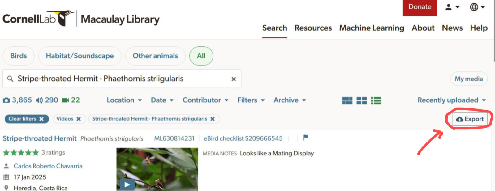

 

```{r setup, eval = TRUE, echo = FALSE, message=FALSE}

library(knitr)
library(htmlwidgets)
library(suwo)

# Create custom printing method
.print_df <- function(x, highlight = NULL, ...) {
  kbl <- kableExtra::kable(
    head(as.data.frame(x)),
    align = "c",
    row.names = FALSE,
    format = "html",
    escape = FALSE
  )
  
  if (!is.null(highlight))
    kbl <- kableExtra::column_spec(
      kbl,
      column = which(names(x) %in% highlight),
      background = "#ccebff",
      bold = TRUE
    )
  
  kbl <- kableExtra::kable_styling(kbl, bootstrap_options = "striped", font_size = 14)
  kbl <- kableExtra::scroll_box(kbl, width = "100%", height = "300px")
  
  asis_output(kbl)
}

# Register custom data frame print method
registerS3method("knit_print", "data.frame", .print_df)

# Global chunk options
knitr::opts_chunk$set(
  fig.width = 5,
  fig.height = 3.5,
  dpi = 70,
  comment = "",
  out.width = "80%",
  fig.align = "center",
  message = TRUE,
  warning = TRUE
)

options(width = 100, max.print = 100)


```


<div class="alert alert-info">

This vignette provides an overview of the suwo package and its functionalities. For detailed information on each function, please refer to the [function reference](https://maRce10.github.io/suwo/reference/index.html) or use the help files within R (e.g., `?query_gbif`).

</div>

The suwo package is designed to simplify the retrieval of nature media (mostly photos, audio files and videos) across multiple online biodiversity databases. This vignette provides an overview of the package’s core querying functions, the searching and downloading of media files, and the compilation of metadata from various sources. 

# Installation

```{r, eval = FALSE, echo = FALSE}

#Install from CRAN:

# From CRAN would be
install.packages("suwo")

#load package
library(suwo)


```

Install the latest development version from GitHub:

```{r, eval = FALSE}

# install package
remotes::install_github("maRce10/suwo")

#load packages
library(suwo)

```

# Basic workflow for obtaining nature media files

Finding data using suwo follows a basic sequence. The following diagram illustrates this workflow and the main functions involved:

<center></center>

<br>
Here is a description of each step:

1. Queries regarding a specific taxonomic group (typically a species name) is submitted through one of the available query functions (`query_repo_name()`) that connect to five different online repositories. The output of these queries is a data frame containing metadata associated with the media files (e.g., species name, date, location, etc, see below). 

1. If multiple repositories are queried, the resulting metadata data frames can be merged into a single data frame using the `merge_metadata()` function. 

1. Check for duplicate records in their datasets using the `find_duplicates()` function. Candidate duplicated entries are identified based on matching species name, country, date, user name, and geographic coordinates. User can double check the candidate duplicates and decide which records to keep, which can be done with `remove_duplicates()`.
 
1. Download the media files associated with the metadata using the `download_media()` function. 

1. Finally, users can update their datasets with new records by re-running the queries and merging the new results with their existing datasets using the `update_metadata()` function. 


# Query functions

The following table summarizes the available suwo query functions and the types of metadata they retrieve:

```{r, echo=TRUE}
# Load suwo package
library(suwo)
```


```{r query_summary_table, echo=FALSE, results='asis', message=FALSE}

library(knitr)
library(kableExtra)

tur_ruf_list <- suwo:::tur_ruf_list

tur_ruf_sound_list <- tur_ruf_list[grep("sound", names(tur_ruf_list))]
tur_ruf_sound_list <- tur_ruf_sound_list[order(names(tur_ruf_sound_list))]

# split by "_" and keep the first part
names(tur_ruf_sound_list) <- gsub("_sounds", "", names(tur_ruf_sound_list))

Repository <- sapply(tur_ruf_sound_list, function(x)
  x[1, "repository"])
Function <- sapply(tur_ruf_sound_list, function(x)
  attributes(x)$query_call[[1]])

Function <- sapply(Function, as.character)

file_types <- sapply(Function, function(x)
  paste(formals(x)$format, collapse = ", "))
file_types <- gsub("c, ", "", file_types)
file_types[Function == "query_xenocanto"] <- "sound"

urls = c(
  gbif = "https://www.gbif.org/",
  inaturalist = "https://www.inaturalist.org/",
  macaulay = "https://www.macaulaylibrary.org/",
  observation = "https://observation.org/",
  wikiaves = "https://www.wikiaves.com.br/",
  `xeno-canto` = "https://www.xeno-canto.org/"
)

urls <- urls[match(names(tur_ruf_sound_list), names(urls))]

token <- c(
  gbif = "No",
  inaturalist = "No",
  macaulay = "No",
  observation = "Yes",
  wikiaves = "No",
  `xeno-canto` = "Yes"
)

token <- token[match(names(tur_ruf_sound_list), names(token))]


tax_level <-  c(
  gbif = "Species",
  inaturalist = "Species",
  macaulay = "Species",
  observation = "Species",
  wikiaves = "Species",
  `xeno-canto` = "Species, genus, family"
)

tax_level <- tax_level[match(names(tur_ruf_sound_list), names(tax_level))]

geo_cover <-  c(
  gbif = "Worldwide",
  inaturalist = "Worldwide",
  macaulay = "Worldwide",
  observation = "Worldwide",
  wikiaves = "Brazil",
  `xeno-canto` = "Worldwide"
)

geo_cover <- geo_cover[match(names(tur_ruf_sound_list), names(geo_cover))]


colnames <- lapply(tur_ruf_sound_list, names)

colnames <- lapply(colnames, function(x)
  setdiff(x, suwo:::.format_query_output(only_basic_columns = TRUE)))

additional_data <- sapply(colnames, function(x)
  paste(x, collapse = ", "))

additional_data <- additional_data[match(names(tur_ruf_sound_list), names(additional_data))]

query_summary <- data.frame(
  Function = Function,
  Repository = Repository,
  `URL link` = urls,
  `File types` = file_types,
  `Requires token` = token,
  `Taxonomic level` = tax_level,
  `Geographic coverage` = geo_cover,
  `Additional data` = additional_data,
  stringsAsFactors = FALSE,
  check.names = FALSE
)


query_summary$`URL link` <- kableExtra::cell_spec(query_summary$`URL link`,
                                                  "html",
                                                  link = query_summary$`URL link`,
                                                  new_tab = TRUE)

query_summary$Function <- kableExtra::cell_spec(
  query_summary$Function,
  "html",
  link = paste0(
    "https://marce10.github.io/suwo/reference/",
    query_summary$Function,
    ".html"
  ),
  new_tab = TRUE
)

query_summary[, names(query_summary) != "Additional data"] |>
  kableExtra::kbl(
    caption = "Table 1: Summary of query functions.",
    format = "html",
    escape = FALSE,
    row.names = FALSE
  ) |>
  kableExtra::kable_styling(
    bootstrap_options = c("striped", "hover", "condensed", "responsive"),
    full_width = FALSE,
    position = "left"
  )

```

This is an example code of a query of _Turdus rufiventris_ (a bird species) sounds from Xeno-canto and Wikiaves (we print the first 4 rows of each output data frame):

```{r, eval = TRUE}
# Load suwo package
library(suwo)

# Query Xeno-canto for Turdus rufiventris sounds
truf_xc <- query_xenocanto(term = "Turdus rufiventris")

head(truf_xc, 4)
```


```{r, eval = FALSE}
# Query Wikiaves for Turdus rufiventris sounds
truf_wa <- query_wikiaves(term = "Turdus rufiventris", format = "sound")

head(truf_wa, 4)
```

```{r, echo=FALSE}

head(tur_ruf_sound_list$wikiaves[, suwo:::.format_query_output(only_basic_columns = TRUE)], 4)

```


By default all query function return the `r length(suwo:::.format_query_output(only_basic_columns = TRUE))` most basic metadata fields associated with the media files. Here is the definition of each field:

 - **repository**: Name of the repository
 - **format**: Type of media file (e.g., sound, photo, video)
 - **key**: Unique identifier of the media file in the repository
 - **species**: Species name associated with the media file (Note taxonomic authority may vary among repositories)
 - **date***: Date when the media file was recorded/photographed (in YYYY-MM-DD format or YYYY if only year is available)
 - **time***: Time when the media file was recorded/photographed (in HH:MM format)
 - **user_name***: Name of the user who uploaded the media file
 - **country***: Country where the media file was recorded/photographed
 - **locality***: Locality where the media file was recorded/photographed
 - **latitude***: Latitude of the location where the media file was recorded/photographed (in decimal degrees) 
 - **longitude***: Longitude of the location where the media file was recorded/photographed (in decimal degrees)
 - **file_url**: URL link to the media file (used to download media files)
 - **file_extension**: Extension of the media file (e.g., .mp3, .jpg, .mp4)
 
_* Can contain missing values (NAs)_

Users can also download all available metadata by setting the argument `all_data = TRUE`. These are the additional metadata fields, on top of the basic fields, that are retrieved by each query function:

```{r, echo=FALSE, results='asis', message=FALSE}

query_summary[, c("Function", "Additional data")] |>
  kableExtra::kbl(
    caption = "Table 2: Additional metadata per query function.",
    format = "html",
    escape = FALSE,
    row.names = FALSE
  ) |>
  kableExtra::kable_styling(
    bootstrap_options = c("striped", "hover", "condensed", "responsive"),
    full_width = FALSE,
    position = "left"
  )

```

## Query Macaulay Library interactively

`query_macaulay()` is the only interactive function. This means that when users run a query the function opens a browser window to the Macaulay Library's search page, where the users must download a .csv file with the metadata:

```{r, eval = FALSE}
# Query Wikiaves for Turdus rufiventris sounds
truf_ml <- query_macaulay(term = "Turdus rufiventris", format = "sound")
```

Users must click on the "Export" button to save the .csv file with the metadata: 

<center></center>

The file must be saved in the directory specified by the `path` argument of the function (default is the current working directory). The function will not proceed until the file is saved. Here are some additional instructions for using this function properly:

* Users must save the save the .csv file manually
* If the file is saved overwritting a pre-existing file (i.e. same file name) the function will not detect it
* The query term must be a species name
* Users must log in to the Macaulay Library/eBird account in order to access large batches of observations

After saving the file, the function will read the file and return a data frame with the metadata. Here we print the first 4 rows of the output data frame:

```{r, eval=FALSE}
head(truf_ml, 4)
```

```{r, echo=FALSE}
head(tur_ruf_sound_list$macaulay[, suwo:::.format_query_output(only_basic_columns = TRUE)], 4)

```

Even if logged in, a maximum of 10000 records per query can be returned. This can be bypassed by using the 'dates' argument to split the search into a sequence of shorter date ranges. The rationale is that by splitting the search into date ranges, users can download multiple .csv files, which are then combined by the function into a single metadata data frame. Of course users must download the csv for each data range.  The following code looks for photos of the hummingbird _Calypte costae_. As Macaulay Library hosts more than 30000 _Calypte costae_ records, we need to split the query into multiple date ranges:

```{r, eval = FALSE}
# test a query with more than 10000 results paging by date
cal_cos <- query_macaulay(
  term = "Calypte costae",
  format = "image",
  path = tempdir(),
  dates = c(1976, 2019, 2022, 2024, 2025, 2026)
)
```

Users can check at the Macaulay Library website how many records are available for their species of interest (see image below) and then decide how to split the search by date ranges accordingly so each sub-query has less than 10000 records. 

<center></center>


<div class="alert alert-warning">

<font size = "4">Obtaining raw data</font>

By default the package standardizes the information in the basic fields (detailed above) in order to facilitate the compilation of metadata from multiple repositories. However, in some cases this may result in loss of information. For instance, some repositories allow users to provide "morning" as a valid time value, which are converted into NAs by suwo. In such cases, users can retrieve the original data by setting the `raw_data = TRUE` in the query functions and/or global options (`options(raw_data = TRUE)`). Note that subsequent data manipulation functions (e.g., `merge_metadata()`, `find_duplicates()`, etc) will not work properly as the basic fields are not standardized.

</div>

# Update metadata

The `update_metadata()` function allows users to update a previous query to add new information from the corresponding repository of the original search. This function takes as input a data frame previously obtained from any query function (i.e. `query_reponame()`) and returns a data frame similar to the input with new data appended. 

To show case the function, we will use the metadata from the previous example of _Turdus rufiventris_ sounds from Xeno-canto. Let's assume that the initial query was done a while ago and we want to update it to include any new records that might have been added since then. The following code removes all observations recorded after 2024-12-31 to simulate an old query:


```{r}
# exclude new observations (simulate old data)
old_truf_xc <- subset_metadata(truf_xc, date <= "2024-12-31" |
                                 is.na(date))

# update "old" data
updated_xc <- update_metadata(metadata = old_truf_xc)

# compare number of records
nrow(truf_xc) == nrow(updated_xc)

```

Note the use of the suwo function `subset_metadata()` to filter the data frame by date. This is a modified version of `base::subset()` that makes sure that the attributes of the data frame are preserved, which are needed by subsequent suwo functions working on metadata. Those attributes will be lost if you use `dplyr::filter()`, `base::subset()` or the extract operator `[` (e.g. `metadata[1:3, ]`).

# Combine metadata from multiple repositories

The `merge_metadata()` function allows users to combine metadata data frames obtained from multiple query functions into a single data frame. The function will match the basic columns of all data frames. Data from additional columns (for instance when using 'all_data = TRUE' in the query) will only be combined if the column names from different repositories match. The function will return a data frame that includes a new column called `source` indicating the name of the original metadata data frame: 

```{r, eval = FALSE}

# query multiple repositories
truf_xc <- query_xenocanto(term = "Turdus rufiventris")
truf_gbf <- query_gbif(term = "Turdus rufiventris", format = "sound")
truf_ml <- query_macaulay(term = "Turdus rufiventris",
                          format = "sound",
                          path = tempdir())

# merge metadata
merged_metadata <- merge_metadata(truf_xc, truf_gbf, truf_ml)

head(merged_metadata, 4)
```

```{r, echo=FALSE}

merged_metadata <- suwo:::merged_metadata

head(merged_metadata, 4)

```

# Find and remove duplicated records

When compiling data from multiple repositories, duplicated media records are a common issue. These duplicates occur both through data sharing between repositories like Xeno-Canto and GBIF, and when users upload the same file to multiple platforms. To help users efficiently identify these duplicate records, suwo provides the find_duplicates() function.

The `find_duplicates()` function helps users identify potential duplicate records in their metadata data frames. Duplicates are identified based on matching species name, country, date, user name, and locality. The function uses a fuzzy matching approach to account for minor variations in the data (e.g., typos, different location formats, etc).The output is a data frame with the candidate duplicate records, allowing users to review and decide which records to keep.

In this example we look for possible duplicates in the merged metadata data frame from the previous section:

```{r, eval = TRUE}
# find duplicates
dups_merged_metadata <- find_duplicates(merged_metadata)

# look first 6 columns
head(dups_merged_metadata)
```

Note that the `find_duplicates()` function adds a new column called `duplicate_group` to the output data frame. This column assigns a unique identifier to each group of potential duplicates, allowing users to easily identify and review them. For instance, in the example above, records from duplicated group 39 belong to the same user, were recorded on the same date and time in the same country:

```{r}
# look at duplicated group 39
subset(dups_merged_metadata, duplicate_group == 39)

```

Also note that the locality is not exactly the same for these records, but the fuzzy matching approach used by `find_duplicates()` was able to identify them as potential duplicates.

Once users have reviewed the candidate duplicates, they can use the `remove_duplicates()` function to eliminate unwanted duplicates from their metadata data frames. This function takes as input a metadata data frame (either the original or the output of `find_duplicates()`) and a vector of row numbers indicating which records to remove:


```{r}
# remove duplicates (for illustration we remove the first record of each duplicate group)
dedup_metadata <- remove_duplicates(dups_merged_metadata)
```


The output is a data frame similar to the input but without the specified duplicate records:
```{r}
# look at first 4 columns of deduplicated metadata
head(dedup_metadata, 4)
```

When duplicates are found, one observation from each group of duplicates is retained in the output data frame. However, if multiple observations from the same repository are labeled as duplicates, by default (`same_repo = FALSE`) all of them are retained in the output data frame. This is useful as it can be expected that observations from the same repository are not true duplicates (e.g. different recordings uploaded to Xeno-Canto with the same date, time and location by the same user), but rather have not been documented with enough precision to be told apart. This behavior can be modified. If `same_repo = TRUE`, only one of the duplicated observations from the same repository will be retained in the output data frame. The function will give priority to repositories in which media downloading is more straightforward (i.e. Xeno-Canto and GBIF), but this can be modified with the argument 'repo_priority'.

# Donwload media files

The last step of the workflow is to download the media files associated with the metadata. This can be done using the `download_media()` function, which takes as input a metadata data frame (obtained from any query function or any of the other metadata managing functions) and downloads the media files to a specified directory. For this example we will download images from a query on `Amanita zambiana` (a mushroom) on GBIF:

```{r, eval = FALSE}
# query GBIF for Amanita zambiana images
amus_gbf <- query_gbif(term = "Amanita zambiana", format = "image")

# download media files to a temporary directory
amus_files <- download_media(metadata = amus_gbf, path = tempdir())

```

```{r, eval = TRUE, echo = FALSE}

# query GBIF for Amanita zambiana images
amus_gbf <- query_gbif(term = "Amanita zambiana", format = "image")

amus_gbf <- subset_metadata(amus_gbf, 1:6)

# download media files to a temporary directory
amus_files <- download_media(metadata = amus_gbf, path = tempdir())

```

The output of the function is a data frame similar to the input metadata but with two additional columns indicating the file name of the downloaded files ('download_file_name') and the result of the download attempt ('download_status', with values "success", 'failed', 'already there (not downloaded)' or 'overwritten').

Here we print the first 3 rows of the output data frame:

```{r, eval = TRUE}

head(amus_files, 3)

```

Here we create a 6 panel plot of 6 of the downloaded images (just for illustration purpose):
```{r}
# create a 6 pannel plot of the downloaded images
par(mfrow = c(2, 3), mar = c(1, 1, 2, 1))

for (i in 1:6) {
  img <- jpeg::readJPEG(file.path(tempdir(), amus_files$download_file_name[i]))
  plot(
    1:2,
    type = 'n',
    axes = FALSE
  )
  rasterImage(img, 1, 1, 2, 2)
  title(main = paste(
    amus_files$country[i],
    amus_files$date[i],
    sep = " \n "
  ))
}

```

Users can also save the downloaded files into sub-directories with the argument `folder_by`. The argument `folder_by` takes a character of factor column with the names of two or more metadata fields to create sub-directories within the main download directory (suplied with the argument `path`). For instance, the following code saves the previous images into sub-directories by country:

```{r}

# download media files to a temporary directory, creating sub-directories by country
amus_files <- download_media(metadata = amus_gbf,
                             path = tempdir(),
                             folder_by = "country")

```

In such case the name of the downloaded files will include the sub-directory name:
```{r}

amus_files$download_file_name

```

<font size="4">Session information</font>

```{r session info, echo=F}

sessionInfo()

```

